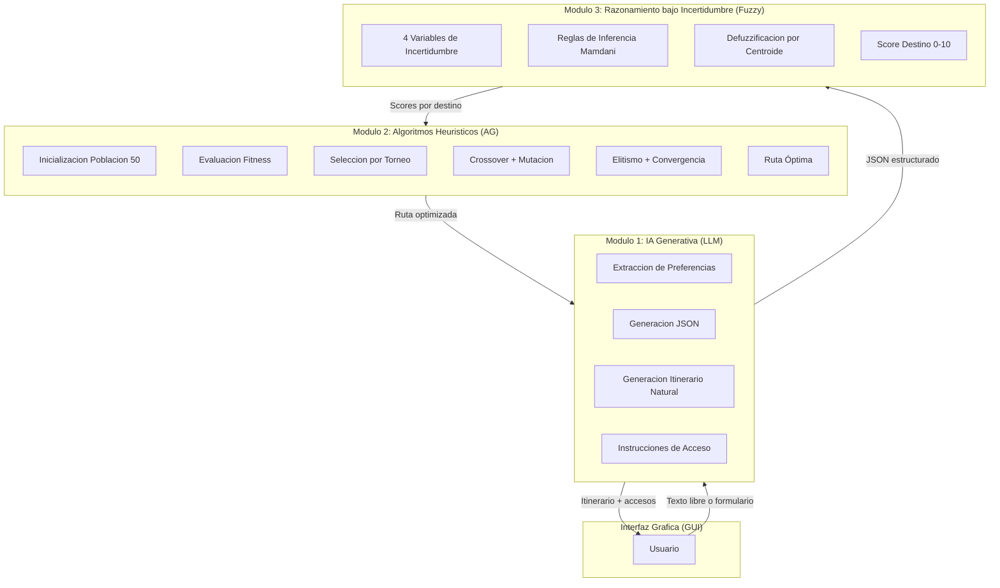
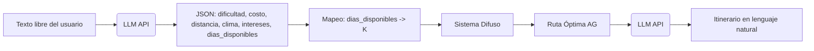
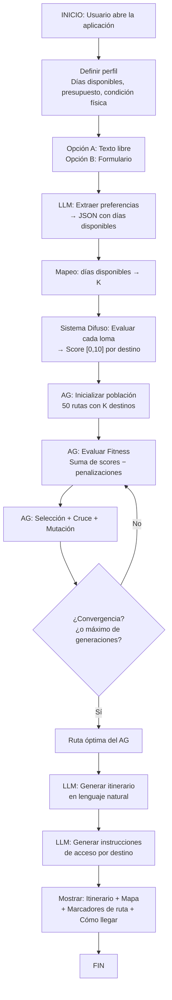
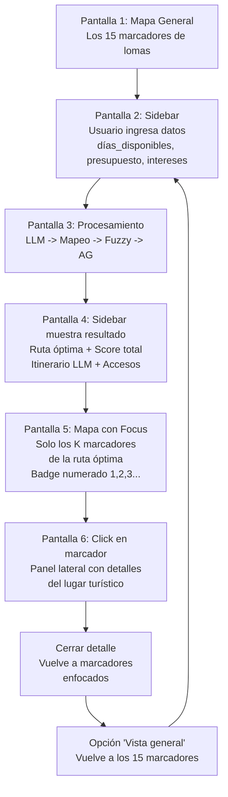
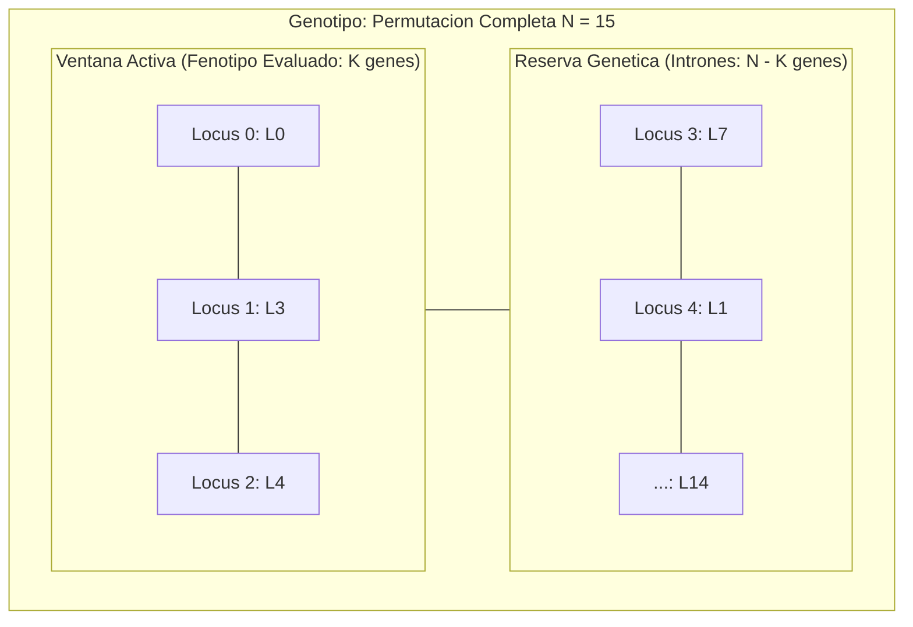
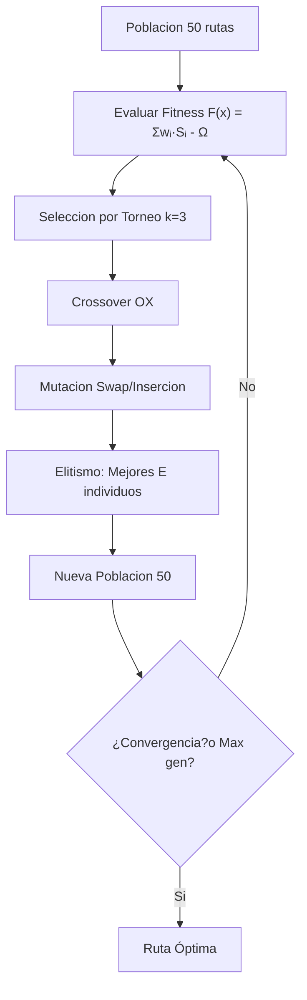
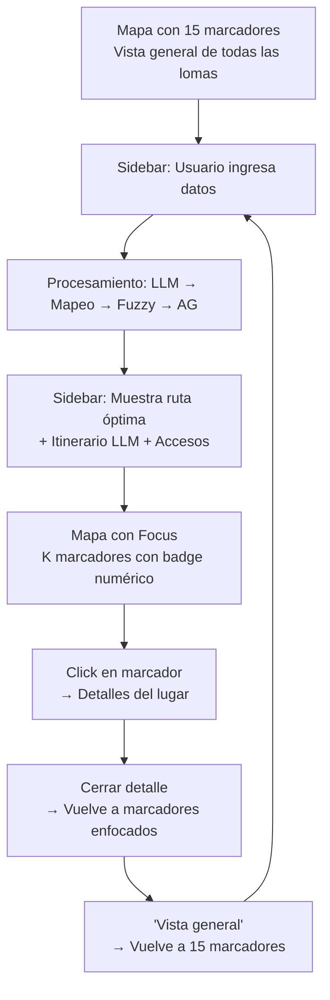
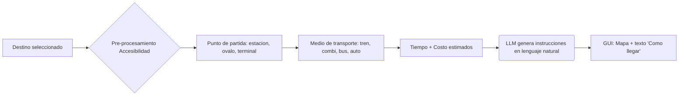

# Sistema Inteligente de Optimización de Rutas de Trekking en las Lomas de Lima

## 1. Introducción y Problemática

### 1.1 Contexto General: Concentración Turística en el Perú

El turismo en el Perú se encuentra fuertemente concentrado en un reducido número de destinos icónicos —Machu Picchu, Cusco, Islas Ballestas— lo que genera saturación, deterioro del patrimonio, congestión operativa y una distribución económica desigual entre regiones. Mientras estos destinos superan su capacidad de carga turística, otros atractivos de igual valor cultural o natural permanecen subutilizados. Este fenómeno no solo afecta a la economía regional, sino que también genera degradación ambiental en los puntos más visitados y abandón en los menos conocidos.

### 1.2 Problema Específico: Las Lomas de Lima como Áreas Verdes Subutilizadas

Lima, con aproximadamente 70,000 hectáreas de lomas distribuidas en 10 distritos, posee un ecosistema único: las **lomas costeras** son formaciones vegetales que florecen durante la temporada de **garúa** (junio–octubre), cuando la niebla del océano Pacífico permite el desarrollo de flora y fauna endémica en medio del desierto. Este ecosistema es gestionado por el **Área de Conservación Regional (ACR) Sistema de Lomas de Lima**, creada en 2019 con meta de conservación para 2042, y administrada por el Gobierno Regional de Lima Metropolitana (GRML).

Sin embargo, existen problemas significativas:

- **Turismo concentrado en pocos destinos urbanos**: Los visitantes se aglomeran en Miraflores, Barranco y el Centro Histórico, ignorando las lomas de Lima que ofrecen trekking real, biodiversidad endémica y experiencias de conexión con la naturaleza.
- **Falta de sistemas de recomendación inteligentes**: No existe ninguna aplicación peruana que combine información de rutas de trekking, recomendaciones personalizadas y planificación de itinerarios para las lomas de Lima. La app chilena *Andeshandbook* de SERNATUR cubre rutas de montaña, pero no el ecosistema de lomas limeñas.
- **Acceso logístico complejo**: Las lomas de Lima están distribuidas en distritos alejados del centro y su acceso requiere combinar transporte público (tren eléctrico, combis, buses), lo que desincentiva la visita even cuando el destino es atractivo.
- **Ecosistemas amenazados**: Las lomas enfrentan invasiones, tráfico de terrenos y construcción ilegal, lo que pone en riesgo un patrimonio natural irremplazable. El proyecto EbA Lomas de la UNDP promueve el ecoturismo sostenible como alternativa económica para las comunidades locales.

### 1.3 Necesidad de un Sistema Inteligente Integrado

Para abordar estos problemas, se requiere un sistema que no solo optimize rutas de trekking, sino que también:

- **Interprete las preferencias del usuario** en lenguaje natural (texto libre).
- **Razone bajo incertidumbre** sobre las condiciones de cada loma (seguridad, clima, accesibilidad).
- **Optimice la selección y orden de destinos** mediante algoritmos heurísticos.
- **Genere un itinerario comprensible** en lenguaje natural con instrucciones de acceso.
- **Proporcione información de cómo llegar** a cada destino, incluyendo rutas de transporte.

---

## 2. Propuesta de Solución

### 2.1 Visión General

Se propone el desarrollo de un **Software Inteligente de Optimización de Rutas de Trekking en las Lomas de Lima**, una aplicación web con interfaz gráfica que integra tres componentes complementarios: **Inteligencia Artificial Generativa (LLM)**, **Algoritmos Heurísticos (Algoritmo Genético)** y **Razonamiento bajo Incertidumbre (Lógica Difusa)**.

El sistema permite al usuario expresar sus preferencias turísticas de forma flexible (ya sea mediante un formulario estructurado o escribiendo en texto libre), evalúa las condiciones de cada loma mediante inferencia difusa, optimiza la selección y orden de destinos mediante un algoritmo genético, y finalmente genera un itinerario claro y detallado con instrucciones de acceso en lenguaje natural.

La aplicación se implementa con **Streamlit** (web en Python) para la interfaz, **folium** para el mapa interactivo, y se despliega como una app web accesible desde cualquier navegador.

### 2.2 Alcance y Delimitación


| Aspecto              | Delimitación                                                                       |
| -------------------- | ---------------------------------------------------------------------------------- |
| **Geografía**        | Lima Metropolitana y provincia de Lima (15 destinos de lomas)                      |
| **Actividad**        | Trekking y exploración de lomas                                                    |
| **Usuario**          | Turista nacional y extranjero interesado en naturaleza                             |
| **Temporada**        | Época de garúa (junio–octubre) como temporada óptima                               |
| **Tecnología**       | Python (Streamlit, folium, scikit-fuzzy, LLM API)                                  |
| **Días disponibles** | Determina K (destinos visitables): K = ceil(días\_disponibles / 4), con K\_max = 8 |
| **Stack**            | Streamlit + folium (Python puro, sin frontend separado)                            |


### 2.3 Diferenciadores Respecto a Soluciones Existentes


| Aspecto                                       | Apps existentes                    | Este proyecto                                          |
| --------------------------------------------- | ---------------------------------- | ------------------------------------------------------ |
| **Razonamiento bajo incertidumbre**           | No aplican                         | 4 variables difusas de incertidumbre (Mamdani)         |
| **Optimización de rutas**                     | No optimizan (son guías estáticas) | Algoritmo Genético multiobjetivo                       |
| **IA Generativa**                             | No integran                        | LLM para interpretar preferencias y generar itinerario |
| **Enfoque en lomas de Lima**                  | No existe                          | Específico y detallado                                 |
| **Instrucciones de acceso**                   | No generan rutas de transporte     | LLM genera cómo llegar a cada loma                     |
| **Sistema de recomendación adaptativo**       | No lo tienen                       | Score continuo \[0,10\] por destino                    |
| **Mapa interactivo con marcadores numerados** | No lo tienen                       | Folium con focus en ruta óptima y badge de orden       |
| **Planificación según días disponibles**      | No lo tienen                       | K dinámico según días\_disponibles del usuario         |


---

## 3. Arquitectura del Sistema

### 3.1 Diagrama de Arquitectura General



### 3.2 Módulo 1: IA Generativa (LLM)

**Función**: Conectado mediante API, este módulo cumple tres roles:

1. **Interpretación de solicitudes del usuario**: El usuario puede escribir en texto libre sus preferencias (ejemplo: *"Quiero un trek de media dificultad este finde, con lomas verdes, que no sea muy caro, sin ir muy lejos"*). El LLM extrae entidades estructuradas: dificultad, clima preferido, costo máximo, distancia máxima, **días disponibles**.
2. **Generación de entradas estructuradas**: Produce un JSON tipificado con los parámetros del turista, incluyendo los **días\_disponibles** que se enviará al módulo de mapeo para determinar K.
3. **Generación de resultados en lenguaje natural**: Toma la ruta óptima del AG y las instrucciones de acceso, y produce un itinerario detallado, comprensible y amigable para el usuario.

**Flujo del LLM:**



### 3.3 Módulo 2: Algoritmos Heurísticos (Algoritmo Genético)

**Función**: Motor de optimización que busca, dentro del espacio combinatorio de rutas posibles, aquella que maximiza la afinidad del turista con los destinos y la diversificación turística, respetando restricciones duras de presupuesto, tiempo y temporada.

**Detalles técnicos**:

- **Tipo de problema**: Optimización combinatoria NP-hard, multiobjetivo con restricciones
- **Representación**: Cromosoma de permutación (cada destino aparece una única vez)
- **Operadores**: Selección por torneo, cruce ordenado (Order Crossover), mutación swap
- **Criterio de parada**: Número máximo de generaciones o convergencia del fitness

Se detalla en la sección 6.

### 3.4 Módulo 3: Razonamiento bajo Incertidumbre (Lógica Difusa)

**Función**: Cuantifica de forma continua el nivel de recomendación de cada loma ($S_{\text{difuso}} \in [0, 10]$), combinando **4 variables cualitativas de verdadera incertidumbre** (Saturación Turística, Seguridad Percibida, Estado Ecosistémico/Clima y Accesibilidad Cualitativa) mediante un sistema de inferencia Mamdani. 

Esto permite al sistema razonar sobre factores dinámicos, subjetivos o imprecisos de Lima. Por diseño arquitectónico y para evitar la explosión combinatoria ($3^4 = 81$ reglas vs. $3^9 = 19,683$), las variables deterministas como **Costo** (Soles) y **Distancia** (km) se delegan al Algoritmo Genético como funciones de costo y restricciones duras ($\Omega_{\text{presupuesto}}$, $\Omega_{\text{tiempo}}$), garantizando una estricta y limpia separación de responsabilidades.

Se detalla en la sección 5.

### 3.5 Flujo End-to-End del Sistema



### 3.6 Flujo de Interacción del Usuario

La interfaz se divide en **dos paneles**: una barra lateral (sidebar) con los controles de entrada y resultados, y un área principal con el mapa interactivo generado por folium.



**Descripción de cada pantalla:**


| Pantalla | Contenido                                                                                                | Ubicación               |
| -------- | -------------------------------------------------------------------------------------------------------- | ----------------------- |
| 1        | Mapa con los 15 marcadores de todas las lomas                                                            | Área principal          |
| 2        | Sidebar con formulario: días\_disponibles, presupuesto, intereses, condición física                      | Barra lateral           |
| 3        | Indicador de procesamiento: LLM → Mapeo → Fuzzy → AG                                                     | Barra lateral           |
| 4        | Sidebar muestra: ruta óptima (K destinos en orden), score total, itinerario LLM, instrucciones de acceso | Barra lateral           |
| 5        | Mapa con focus en K marcadores de la ruta, cada uno con badge numérico de orden                          | Área principal          |
| 6        | Click en marcador → panel con detalles del lugar (tipo, score, dificultad, costo, accesibilidad)         | Panel lateral emergente |
| 7        | Vista de detalle cerrada → vuelve a marcadores enfocados                                                 | Área principal          |
| 8        | Botón "Vista general" → vuelve a los 15 marcadores                                                       | Barra lateral           |
| 9        | Botón "Nueva ruta" → permite ingresar nuevos datos                                                       | Barra lateral           |


**Interacciones confirmadas:**

- El usuario puede presionar un marcador para ver información del lugar (similar a una vista de detalles de mapa)
- El usuario puede cerrar la vista de detalle y volver a los marcadores enfocados
- El usuario puede cerrar o mantener la ventana de proceso de optimización
- El usuario puede volver a ingresar datos y generar una nueva ruta óptima mediante el algoritmo
- **No se incluye chat** — toda la información se muestra estructurada en la sidebar

---

## 4. Catálogo de Destinos Turísticos

### 4.1 Tabla de Destinos


| ID  | Destino                         | Distrito   | Tipo                    | Dificultad    | Distancia desde C. | Ej. Saturación | Acceso principal       |
| --- | ------------------------------- | ---------- | ----------------------- | ------------- | ------------------ | -------------- | ---------------------- |
| L0  | Lomas del Paraíso (+ Apu Siqay) | VMT        | Naturaleza/Trekking     | Moderado      | \~1h               | 0.15           | Tren eléctrico + combi |
| L1  | Lomas de Carabayllo 2           | Carabayllo | Naturaleza/Trekking     | Fácil-Difícil | \~1.5h             | 0.20           | Bus + caminata         |
| L2  | Lomas de Primavera              | Carabayllo | Naturaleza/Trekking     | Fácil         | \~1h               | 0.10           | Bus                    |
| L3  | Lomas de Manchay                | Ate        | Naturaleza              | Moderado      | \~45 min           | 0.08           | Bus                    |
| L4  | Lomas de Mangomarca             | SJL        | Naturaleza/Arqueología  | Moderado      | \~1h               | 0.15           | Bus                    |
| L5  | Lomas de Amancaes               | Rímac      | Naturaleza              | Fácil         | \~40 min           | 0.45           | Corredor Azul          |
| L6  | Lomas de Lachay (Reserva)       | Huarochirí | Naturaleza/Reserva      | Fácil-Mod     | \~2h               | 0.50           | Bus/auto               |
| L7  | Lomas de Lúcumo                 | Pachacamac | Naturaleza/Arqueología  | Fácil         | \~1h               | 0.45           | Panamericana Sur       |
| L8  | Morro Solar                     | Chorrillos | Naturaleza/Vista        | Fácil         | \~30 min           | 0.70           | Metro + bus            |
| L9  | Huaca Pucllana                  | Miraflores | Cultural/Arqueología    | Muy fácil     | \~15 min           | 0.85           | Metro                  |
| L10 | Parque de la Reserva            | San Isidro | Naturaleza/Urbano       | Muy fácil     | \~10 min           | 0.65           | Metro                  |
| L11 | Lomas de Ancón                  | Ancón      | Naturaleza/Conservación | Fácil         | \~45 min           | 0.12           | Bus                    |
| L12 | Quebrada de Huaycoloro          | Lurín      | Naturaleza/Cañón        | Moderado      | \~1h               | 0.18           | Bus                    |
| L13 | Cerro de la Estrella            | Ate        | Naturaleza/Vista        | Fácil         | \~40 min           | 0.40           | Metro + bus            |
| L14 | La Loma Amarilla                | Surco      | Naturaleza/Urbano       | Muy fácil     | \~20 min           | 0.55           | Metro                  |


### 4.2 Detalle de Accesos por Destino

Cada destino cuenta con información de acceso que se integra como un **módulo complementario** de pre-procesamiento. Esta información alimenta la variable difusa de **Accesibilidad** y es utilizada por el LLM para generar instrucciones de viaje.

**Ejemplo: Lomas del Paraíso (+ Apu Siqay)**

- Punto de partida: Estación María Auxiliadora (Tren Eléctrico)
- Medio de transporte: Tren → Combi
- Distancia al ingreso: 13 km (tren) + 7.8 km (combi)
- Tiempo estimado: \~48 min
- Costo estimado: \~S/4.50
- Nota: Circuito Ecoturístico con guías disponibles desde 2013

**Ejemplo: Lomas de Carabayllo 2**

- Sistema de reservas en: lomas.perupos.com
- 4 rutas oficiales con control de aforo:
  - Ruta Para Todos (Fácil, 30 min)
  - Ruta del Colchón Ancestral (Moderado, 150 min)
  - Ruta El Brujo (Fácil, 60 min)
  - Ruta del Zorro Místico (Difícil, 270 min)
- Punto de partida: Ingreso al ACR Sistema de Lomas de Lima

### 4.3 Nota sobre las Lomas Adicionales

El ACR Sistema de Lomas de Lima (creado en 2019, meta 2042) abarca las lomas de **Ancón, Carabayllo 1 y 2, Amancaes y Villa María del Triunfo**, administradas por el GRML. Lima cuenta con aproximadamente **70,000 hectáreas de lomas** según el IMP y SERPAR. Fuera del ACR se encuentran Lomas de Lachay, Lúcumo, Mangomarca y Manchay, todas incluidas en el catálogo.

---

## 5. Lógica Difusa (Razonamiento bajo Incertidumbre)

### 5.1 Descripción del Sistema y Justificación Arquitectónica

Se utiliza un **sistema de inferencia difusa tipo Mamdani** que toma **4 variables de entrada lingüísticas** representativas de verdadera incertidumbre y produce un **Score de Recomendación Turística** $S_{\text{difuso}} \in [0, 10]$ para cada destino. 

> **Decisión de Diseño Crítica (Reducción de 9 a 4 variables):**
> Inicialmente se consideró un esquema de 9 variables. No obstante, por fundamentos de ingeniería de software e inteligencia artificial:
>
> 1. **Evitar la "Maldición de la Dimensionalidad":** Un sistema de 9 variables con 3 términos cada una requiere un espacio combinatorial de $3^9 = 19,683$ reglas. Con pocas reglas, el 99% del espacio queda sin activación, provocando que la defuzzificación en `scikit-fuzzy` falle (arrojando errores `NaN` o valores planos de 0). Con **4 variables**, el espacio máximo es de $3^4 = 81$ combinaciones, lo cual permite una cobertura completa, robusta y matemáticamente verificable con un conjunto manejable de 20 reglas.
> 2. **Estricta Separación de Responsabilidades:** La Lógica Difusa se reserva para información cualitativa, subjetiva o incierta (percepción de seguridad, verdor estacional, saturación, dificultad del sendero). Las variables deterministas exactas (**Costo en Soles** y **Distancia en km**) pertenecen al **Algoritmo Genético**, que las optimiza como funciones de costo físico y restricciones duras cuadráticas ($\Omega_{\text{presupuesto}}$, $\Omega_{\text{tiempo}}$), evitando la doble penalización.

### 5.2 Las 4 Variables de Entrada Difusas (Verdadera Incertidumbre)

Cada variable se define con su dominio numérico, términos lingüísticos y justificación:

#### V1: Saturación Turística

- **Qué mide**: Nivel de afluencia turística concurrente del destino.
- **Universo de discurso**: Escala normalizada $[0.0, 1.0]$ (0 = vacío/desconocido, 1 = saturación máxima).
- **Términos lingüísticos**:
  - `Baja`: $[0.0, 0.4]$ — Lomas poco concurridas (Paríso, Primavera, Manchay).
  - `Media`: $[0.3, 0.7]$ — Concurrencia habitual (Amancaes, Lúcumo).
  - `Alta`: $[0.6, 1.0]$ — Destinos urbanos o reservas masivas (Morro Solar, Lachay, Huaca Pucllana).
- **Por qué es relevante**: Representa el **eje central del proyecto**: desconcentrar el turismo hacia lomas menos visitadas, premiando con mayor puntaje a los destinos con baja saturación para fomentar el ecoturismo sostenible.
- **Fuente de datos**: Estadísticas de visitas del GRML y reportes de comités locales ecoturísticos.

#### V2: Seguridad Percibida

- **Qué mide**: Percepción cualitativa de seguridad ciudadana en el entorno de la loma y sus accesos.
- **Universo de discurso**: Escala $[0, 10]$ (0 = muy riesgoso, 10 = muy seguro).
- **Términos lingüísticos**:
  - `Riesgoso`: $[0, 4]$ — Zonas periféricas con baja presencia policial o antecedentes de incidentes.
  - `Moderado`: $[3, 7]$ — Zonas con vigilancia vecinal o acceso semiregulado.
  - `Seguro`: $[6, 10]$ — Circuitos cerrados, áreas de conservación con personal o alta seguridad.
- **Por qué es relevante**: La seguridad es una **prioridad absoluta** para el turista. Si una loma presenta alta incertidumbre o riesgo percibido, su recomendación debe decaer drásticamente con independencia de su belleza paisajística.
- **Fuente de datos**: Informes del INEI sobre seguridad distrital, observatorios ciudadanos y retroalimentación de visitantes.

#### V3: Estado Ecosistémico / Clima-Verdor

- **Qué mide**: Calidad del ecosistema según las condiciones de niebla (*garúa*) y verdor estacional.
- **Universo de discurso**: Escala $[0, 10]$ (0 = desértico/seco, 10 = verdor óptimo con colchón de nubes).
- **Términos lingüísticos**:
  - `Seco`: $[0, 4]$ — Fuera de temporada (noviembre a mayo); paisaje árido con escasa vegetación activa.
  - `Favorable`: $[3, 7]$ — Clima nublado o inicio/fin de temporada; verdor intermedio.
  - `Óptimo_Garúa`: $[6, 10]$ — Temporada alta de lomas (junio a octubre); flor de amancaes en floración, vegetación exuberante y niebla densa.
- **Por qué es relevante**: Las lomas son un ecosistema estacional dinámico. El principal valor turístico radica en encontrarlas en su máximo esplendor biológico.
- **Fuente de datos**: Reportes meteorológicos de SENAMHI y estado fenológico de la vegetación (SERFOR / Red de Lomas).

#### V4: Accesibilidad Cualitativa

- **Qué mide**: Grado de facilidad o complejidad para acceder al inicio del sendero (calidad del camino y conexiones).
- **Universo de discurso**: Escala $[0, 10]$ (0 = muy complejo/trocha agreste, 10 = acceso directo pavimentado).
- **Términos lingüísticos**:
  - `Difícil`: $[0, 4]$ — Múltiples trasbordos informales, trochas no señalizadas o caminata prolongada previa.
  - `Media`: $[3, 7]$ — Conexión mediante bus o combi y senderos moderadamente señalizados.
  - `Fácil`: $[6, 10]$ — Acceso directo vía Metro Línea 1, Corredores Complementarios o vía asfaltada con señalética oficial.
- **Por qué es relevante**: El acceso es un factor habilitante clave. Destinos hermosos pero excesivamente inaccesibles o con riesgo de extravío pierden viabilidad para el turista promedio.
- **Fuente de datos**: Aplicativos de transporte público (TuRuta, Rumbo), guías del ACR Lomas de Lima y mapeo OSM.

---

### 5.3 Reubicación de las Otras 5 Variables Fuera del Módulo Difuso

Para asegurar claridad absoluta en el equipo y ante la sustentación académica, las variables restantes se administran en los componentes computacionales correspondientes:

1. **Costo (S/):** Al **Algoritmo Genético**. Se calcula sumando entradas y pasajes reales, evaluado en la restricción dura cuadrática $\Omega_{\text{presupuesto}} = \max(0, \text{CostoTotal} - \text{Presupuesto})^2$.
2. **Distancia / Desplazamiento (km):** Al **Algoritmo Genético**. Se computa la distancia geográfica real (fórmula Haversine) entre lomas consecutivas para minimizar traslados innecesarios.
3. **Pendiente / Dificultad Física:** Al **Módulo LLM / Perfil del Usuario**. El LLM extrae si el usuario es principiante, intermedio o avanzado, aplicando un filtro de pre-selección sobre los senderos viables.
4. **Biodiversidad:** Al **Módulo LLM / Afinidades**. Se utiliza en el prompt de recomendación e itinerario como un factor de emparejamiento con los gustos del turista (ej. avistamiento de aves, botánica).
5. **Impacto Ambiental:** Integrado dentro de la variable de **Saturación Turística**, ya que el impacto ecológico negativo en las lomas es función directa de la sobrecarga de visitantes sobre la capacidad de carga del ecosistema.

---

### 5.4 Base de Reglas de Inferencia Mamdani (20 Reglas Robustas)

El motor de inferencia evalúa el conjunto de reglas tipo:  
`SI (Saturación es ...) Y (Seguridad es ...) Y (Clima es ...) Y (Accesibilidad es ...) ENTONCES (Recomendación es ...)`

Las reglas están calibradas para garantizar que ningún caso real quede sin evaluación:

```text
-- CASOS EXCEPCIONALES: MÁXIMA RECOMENDACIÓN (Muy_Alta: [8.0 - 10.0])
R01: SI Saturacion=Baja Y Seguridad=Seguro Y Clima=Optimo_Garua Y Accesibilidad=Facil     ENTONCES Recomendacion=Muy_Alta
R02: SI Saturacion=Baja Y Seguridad=Seguro Y Clima=Optimo_Garua Y Accesibilidad=Media     ENTONCES Recomendacion=Muy_Alta
R03: SI Saturacion=Baja Y Seguridad=Moderado Y Clima=Optimo_Garua Y Accesibilidad=Facil   ENTONCES Recomendacion=Muy_Alta
R04: SI Saturacion=Media Y Seguridad=Seguro Y Clima=Optimo_Garua Y Accesibilidad=Facil    ENTONCES Recomendacion=Muy_Alta

-- CASOS FAVORABLES: ALTA RECOMENDACIÓN (Alta: [6.5 - 8.5])
R05: SI Saturacion=Baja Y Seguridad=Seguro Y Clima=Favorable Y Accesibilidad=Facil        ENTONCES Recomendacion=Alta
R06: SI Saturacion=Baja Y Seguridad=Moderado Y Clima=Favorable Y Accesibilidad=Media      ENTONCES Recomendacion=Alta
R07: SI Saturacion=Baja Y Seguridad=Seguro Y Clima=Optimo_Garua Y Accesibilidad=Dificil   ENTONCES Recomendacion=Alta
R08: SI Saturacion=Media Y Seguridad=Seguro Y Clima=Optimo_Garua Y Accesibilidad=Media    ENTONCES Recomendacion=Alta
R09: SI Saturacion=Media Y Seguridad=Moderado Y Clima=Optimo_Garua Y Accesibilidad=Facil  ENTONCES Recomendacion=Alta

-- CASOS PROMEDIO: RECOMENDACIÓN MEDIA (Media: [4.5 - 6.5])
R10: SI Saturacion=Media Y Seguridad=Moderado Y Clima=Favorable Y Accesibilidad=Media     ENTONCES Recomendacion=Media
R11: SI Saturacion=Baja Y Seguridad=Moderado Y Clima=Seco Y Accesibilidad=Facil          ENTONCES Recomendacion=Media
R12: SI Saturacion=Alta Y Seguridad=Seguro Y Clima=Optimo_Garua Y Accesibilidad=Facil     ENTONCES Recomendacion=Media
R13: SI Saturacion=Media Y Seguridad=Seguro Y Clima=Seco Y Accesibilidad=Media           ENTONCES Recomendacion=Media
R14: SI Saturacion=Baja Y Seguridad=Riesgoso Y Clima=Optimo_Garua Y Accesibilidad=Facil   ENTONCES Recomendacion=Media

-- CASOS DESFAVORABLES: BAJA RECOMENDACIÓN (Baja: [2.5 - 4.5])
R15: SI Saturacion=Alta Y Seguridad=Moderado Y Clima=Favorable Y Accesibilidad=Media     ENTONCES Recomendacion=Baja
R16: SI Saturacion=Media Y Seguridad=Riesgoso Y Clima=Favorable Y Accesibilidad=Media     ENTONCES Recomendacion=Baja
R17: SI Saturacion=Baja Y Seguridad=Moderado Y Clima=Seco Y Accesibilidad=Dificil        ENTONCES Recomendacion=Baja
R18: SI Saturacion=Alta Y Seguridad=Seguro Y Clima=Seco Y Accesibilidad=Dificil          ENTONCES Recomendacion=Baja

-- CASOS CRÍTICOS / INVIABLES: MUY BAJA RECOMENDACIÓN (Muy_Baja: [0.0 - 2.5])
R19: SI Seguridad=Riesgoso Y Accesibilidad=Dificil                                       ENTONCES Recomendacion=Muy_Baja
R20: SI Saturacion=Alta Y Seguridad=Riesgoso Y Clima=Seco                                ENTONCES Recomendacion=Muy_Baja
```

---

### 5.5 Salida Difusificada y Defuzzificación

- **Variable de salida**: **Score de Recomendación Turística (**$S_{\text{difuso}} \in [0, 10]$**)**.
  - Conjuntos de salida: `Muy_Baja` $[0, 2.5]$, `Baja` $[2, 4.5]$, `Media` $[4, 7]$, `Alta` $[6.5, 9]$, `Muy_Alta` $[8, 10]$.
- **Método de Defuzzificación**: **Centroide** (Center of Gravity, CoG). Produce un valor escalar continuo entre $0.0$ y $10.0$ que cuantifica con precisión el grado de conveniencia de cada destino turístico.
- **Rol en el Flujo General**: Este valor continuo $S_{\text{difuso}}(d)$ se calcula previamente para cada una de las 15 lomas y alimenta directamente la función de evaluación (fitness) del Algoritmo Genético.

---

### 6. Algoritmo Genético

### 6.1 Fundamentos Conceptuales: Gen, Cromosoma y Población

Para que el modelo sea comprensible a simple vista, el Algoritmo Genético modela el problema como la organización de un itinerario de viaje grupal:

#### A. El Gen (La Parada Individual)
Es la unidad mínima de información dentro de la solución:

| Elemento del Gen | Concepto Biológico | Equivalente en el Proyecto | Ejemplo Concreto |
| :--- | :--- | :--- | :--- |
| **Locus** | Posición física en el cromosoma | Día u orden de visita en el itinerario | Posición 0 (Día 1 del viaje) |
| **Alelo** | Variante o valor del gen | Código único de la loma asignada | `L0` |
| **Fenotipo** | Rasgo visible manifestado | Destino turístico real que se visita | Lomas del Paraíso (Villa María del Triunfo) |
| **Interpretación** | Información de un rasgo biológico | Instrucción operativa de viaje | *"El primer día del itinerario se visita Lomas del Paraíso"* |

#### B. El Cromosoma (El Itinerario Completo: Titulares vs. Suplentes)
El cromosoma es una lista completa con las **15 lomas de Lima**, organizada bajo una **representación basada en prefijos (Prefix-based Representation)** en dos bloques:
1. **Ventana Activa ($K$ lomas titulares):** Las lomas que el turista **realmente va a recorrer**.
2. **Reserva Durmiente ($15 - K$ lomas suplentes):** Lomas en lista de espera que no se visitan en este momento, pero están listas para ingresar si una mutación decide hacer un cambio de jugador.

**Ejemplo de Cromosoma para un viaje de 3 días ($K = 3$):**

| Posición (Locus) | Código (Alelo) | Nombre de la Loma | Distrito | Rol en el Cromosoma | ¿El turista lo visita? |
| :---: | :---: | :--- | :--- | :--- | :---: |
| **0** | `L0` | Lomas del Paraíso (+ Apu Siqay) | Villa María del Triunfo | **Día 1 (Titular)** | **Sí** |
| **1** | `L3` | Lomas de Manchay | Ate | **Día 2 (Titular)** | **Sí** |
| **2** | `L4` | Lomas de Mangomarca | San Juan de Lurigancho | **Día 3 (Titular)** | **Sí** |
| **3** | `L7` | Lomas de Lúcumo | Pachacámac | Suplente 1 (Lista de espera) | No |
| **4** | `L1` | Lomas de Carabayllo 2 | Carabayllo | Suplente 2 (Lista de espera) | No |
| **5** | `L5` | Lomas de Amancaes | Rímac | Suplente 3 (Lista de espera) | No |
| **...** | ... | ... | ... | ... | No |
| **14** | `L14` | La Loma Amarilla | Santiago de Surco | Suplente 12 (Lista de espera) | No |



*Conclusión del Cromosoma:* La ruta evaluada para el turista es únicamente `L0 -> L3 -> L4`. Las demás 12 lomas no generan costo ni distancia, pero garantizan que el operador de cruce no tenga huecos vacíos ni lomas repetidas.

#### C. La Población (Los 40 Planes de Viaje Compitiendo)
La población es el conjunto de **40 itinerarios alternativos** generados al inicio de forma aleatoria:

| Individuo | Itinerario Activo ($K = 3$) | Lomas en Reserva (Suplentes) | Diagnóstico del Plan | Calidad Inicial Estimada |
| :---: | :--- | :--- | :--- | :--- |
| **Plan 1** | Paraíso $\to$ Manchay $\to$ Mangomarca | Lúcumo, Amancaes, Ancón, ... | Lomas cercanas en Lima Sur/Este, gasto bajo (S/ 35). | **Alta (Candidato a Campeón)** |
| **Plan 2** | Lúcumo $\to$ Ancón $\to$ Lachay | Paraíso, Carabayllo, Primavera, ... | Muy dispersas (>120 km de viaje), pasajes muy caros. | **Baja (Se extinguirá rápido)** |
| **Plan 3** | Carabayllo $\to$ Primavera $\to$ Amancaes | Lúcumo, Manchay, Paraíso, ... | Concentradas en Lima Norte, costo intermedio. | **Media (Mejorable con cruce)** |
| **...** | *(37 planes adicionales generados)* | ... | ... | ... |

---

### 6.2 Mapeo Temporal Urbano Dinámico y Atajo Determinista

1. **Mapeo Urbano Dinámico ($K = \min(\max(2, \text{días}), 6)$):**  
   En Lima Metropolitana, el senderismo en lomas se realiza como una excursión diurna (1 loma por día). Por tanto, para $\text{días} \ge 2$, se asigna $K = \text{días}$ acotado a un mínimo de 2 (para garantizar espacio de búsqueda combinatorio formal) y un máximo de 6 lomas.
2. **Bifurcación de Control para Horizonte Unitario ($K = 1$):**  
   Cuando el usuario dispone de 1 solo día, no existe un problema combinatorio de ordenamiento (espacio de solo 15 estados). El orquestador activa un **atajo determinista (shortcut en $O(N)$)**: filtra las lomas dentro del presupuesto y escoge de inmediato la de mayor score difuso, evitando sobrecosto computacional redundante de 50 generaciones bioinspiradas.

---

### 6.3 La Función Fitness (Aptitud) Explicada en Palabras

Antes de cualquier fórmula matemática, el fitness representa la **calificación general del viaje (de 0 a 30 puntos)** según la siguiente regla en palabras:

$$
\mathbf{Nota\ del\ Viaje\ (Fitness)} = (\text{Belleza\ y\ Calidad\ de\ las\ Lomas}) - (\text{Desgaste\ por\ Viajar\ Lejos}) - (\text{Multa\ por\ Pasarse\ de\ Presupuesto}) - (\text{Multa\ por\ Falta\ de\ Tiempo})
$$

#### Tabla de Criterios: ¿Qué suma puntos y qué resta puntos?

| Criterio Evaluado | Efecto en la Nota | ¿Cómo se calcula en palabras? | Justificación Práctica |
| :--- | :---: | :--- | :--- |
| **Belleza y Calidad Ecoturística** | **Suma (+)** | Suma de los scores difusos (0 a 10) de las lomas titulares. | El turista busca lomas verdes, seguras y con senderos accesibles. |
| **Desgaste por Traslados** | **Resta (-)** | Kilómetros acumulados de viaje entre loma y loma dividido entre 100. | Viajar horas en bus agota al turista y quita tiempo de disfrute. |
| **Multa por Exceso de Presupuesto** | **Castiga (-)** | Si gastas menos o igual que tu presupuesto, multa = 0. Si te pasas, multa proporcional al exceso al cuadrado. | El viaje debe ser pagable; si sobrepasa el dinero del usuario, pierde viabilidad. |
| **Multa por Falta de Tiempo** | **Castiga (-)** | Si las caminatas caben en las 8h útiles por día, multa = 0. Si faltan horas, penaliza al cuadrado. | Las jornadas deben ser realizables sin sobreexigir físicamente al usuario. |

#### Ejemplo Numérico Paso a Paso (Sin Fórmulas Agobiantes)

Supongamos que un usuario dispone de **S/ 60.00 de presupuesto** y **3 días**.

Evaluemos el **Plan 1** (`L0: Paraíso` $\to$ `L3: Manchay` $\to$ `L4: Mangomarca`):

| Paso | Concepto Evaluado | Datos Reales de las Lomas | Cuenta en Palabras | Puntos Aportados |
| :---: | :--- | :--- | :--- | :---: |
| **1** | **Calidad de las Lomas** | Paraíso (8.5 pts) + Manchay (7.5 pts) + Mangomarca (8.0 pts) | Sumar las notas difusas de cada loma | **+24.00 pts** |
| **2** | **Traslados en bus** | Paraíso a Manchay (7.5 km) + Manchay a Mangomarca (16.0 km) | Total 23.5 km $\implies$ Restar $23.5 / 100$ | **-0.23 pts** |
| **3** | **Gasto del Viaje** | Entradas y pasajes: S/ 15 + S/ 10 + S/ 10 = S/ 35 | Costó S/ 35 vs Límite S/ 60 $\implies$ ¡No se pasó! | **-0.00 pts** (Sin multa) |
| **4** | **Horas de Caminata** | Senderos: 4.5h + 3.5h + 4.0h = 12 horas totales | 12h caben en 3 días (24h útiles) $\implies$ Tiempo OK | **-0.00 pts** (Sin multa) |
| **FINAL** | **Calificación Total** | **Fitness = 24.00 - 0.23 - 0.00 - 0.00** | Nota global del itinerario | **23.77 puntos** |

*Comparación:* Si otro plan gastara S/ 90 (50% de sobrecosto), el algoritmo le cobraría una multa de $-6.25$ puntos y su nota caería a **17.52**. En el torneo, el Plan 1 (23.77 pts) vencerá fácilmente al plan caro.

#### Formulación Matemática con Escalado Adimensional Relativo

Para formalizar lo anterior y evitar el *Fitness Scaling Problem*, se implementan barreras relativas:

$$
\boxed{F(x) = \sum_{j=1}^{K} S_{\text{difuso}}(d_j) \;-\; \beta \cdot \left( \frac{\text{DistanciaTotal}(x)}{100} \right) \;-\; \lambda_1 \cdot \left(\frac{\Delta_{\text{presupuesto}}}{\text{Presupuesto}}\right)^2 \;-\; \lambda_2 \cdot \left(\frac{\Delta_{\text{tiempo}}}{\text{TiempoDisponible}}\right)^2 \;-\; \Omega_{\text{unicidad}}}
$$

Donde:
- $\Delta_{\text{presupuesto}} = \max(0,\; \text{CostoTotal}(x) - \text{Presupuesto})$ con $\lambda_1 = 25.0$.
- $\Delta_{\text{tiempo}} = \max(0,\; \text{HorasTotales}(x) - \text{Días} \times 8.0)$ con $\lambda_2 = 25.0$.
- $\Omega_{\text{unicidad}} = 1000 \cdot (K - |\text{set}(x)|)$ como salvaguarda de unicidad.

---

### 6.4 Operadores Genéticos y Dinámica Evolutiva

| Operador Genético | Analogía Biológica | Analogía en el Viaje Turístico | ¿Qué hace exactamente en el código? |
| :--- | :--- | :--- | :--- |
| **Selección por Torneo** | Supervivencia del más apto | Casting: 3 planes al azar compiten y clasifica el de mejor nota | Toma 3 cromosomas de la población y selecciona el de mayor fitness ($k_{\text{torneo}}=3$). |
| **Cruce (Order Crossover)** | Reproducción sexual | Fusión de ideas: combinar las mejores paradas de dos planes | El hijo hereda un tramo del Padre 1 y se completa con el orden del Padre 2 sobre los 15 alelos. |
| **Mutación Swap (Reordenar)** | Mutación genética puntual | Cambiar el orden de dos días para evitar tráfico en Lima | Intercambia dos posiciones dentro de la ventana activa para acortar distancia (prob. 40%). |
| **Mutación Reemplazo (Sustituir)** | Variación alélica | Cambio de jugador: sacar una loma cara y meter una suplente económica | Intercambia un gen activo con un gen de la reserva durmiente (prob. 40%). |
| **Mutación Inversión (2-Opt)** | Reordenamiento cromosómico | Desenredo de ruta: invertir un tramo que hacía un cruce en zigzag | Invierte un subsegmento continuo dentro del viaje activo (prob. 20%). |
| **Elitismo** | Preservación del linaje campeón | El campeón clasifica directo a la final sin jugar eliminatorias | Copia los 2 mejores planes intactos a la siguiente generación ($E=2$). |


**Representación visual de una generación:**



---

## 7. Interfaz Gráfica (GUI)

### 7.1 Descripción General

La interfaz se implementa con **Streamlit** (Python web framework) y se compone de dos paneles: una **barra lateral** con controles de entrada y resultados, y un **área principal** con el mapa interactivo generado por **folium**.

Streamlit permite generar una aplicación web sin necesidad de frontend separado (React, HTML, CSS). El mapa se renderiza con folium embebido en Streamlit mediante la librería `st_folium`.

### 7.2 Componentes de la GUI


| Componente                     | Descripción                                                           | Ubicación        |
| ------------------------------ | --------------------------------------------------------------------- | ---------------- |
| **Formulario de perfil**       | Captura `días_disponibles`, presupuesto, intereses, condición física  | Barra lateral    |
| **Área de texto libre**        | Input opcional para que el usuario escriba sus preferencias           | Barra lateral    |
| **Indicador de procesamiento** | Muestra progreso: LLM → Mapeo → Fuzzy → AG                            | Barra lateral    |
| **Tabla de scores difusos**    | Muestra cada destino con su Score de Recomendación                    | Barra lateral    |
| **Ruta óptima**                | Lista ordenada de K destinos seleccionados por el AG                  | Barra lateral    |
| **Itinerario LLM**             | Texto generado por el LLM con detalles día a día                      | Barra lateral    |
| **Instrucciones de acceso**    | Cómo llegar a cada destino con transporte público (texto)             | Barra lateral    |
| **Mapa interactivo (folium)**  | Muestra los marcadores de las lomas con focus en la ruta óptima       | Área principal   |
| **Badge de orden**             | Número sobre cada marcador indicando su posición en la ruta           | Mapa             |
| **Panel de detalles**          | Al hacer click en un marcador, muestra información completa del lugar | Mapa (emergente) |
| **Botón "Vista general"**      | Restablece el mapa a los 15 marcadores                                | Barra lateral    |
| **Botón "Nueva ruta"**         | Permite al usuario ingresar nuevos datos y generar otra ruta          | Barra lateral    |


### 7.3 Flujo de la Interacción



### 7.4 Justificación del Stack UI

Se eligió **Streamlit + folium** en lugar de React + shadcn + Mapbox por las siguientes razones:

- **Stack unificado en Python**: Todo el sistema (AG, Fuzzy, LLM, GUI) se implementa en un solo lenguaje, eliminando la necesidad de un backend REST separado
- **Despliegue rápido**: Streamlit genera una web automáticamente sin configuración de servidor
- **folium para mapas**: Integra OpenStreetMap interactivo con marcadores, popups y zoom nativo
- **Menor complejidad**: Para un proyecto académico con grupo de 5 personas, la calidad de la lógica (AG + Fuzzy) es más relevante que la estética del frontend
- **Apariencia profesional**: folium con tiles de Mapbox se ve similar a Google Maps, suficiente para el alcance del proyecto
- **Sin polilíneas en el mapa**: La ruta se comunica mediante el badge numérico en cada marcador, no por líneas que podrían confundir al usuario
- **El enunciado pide interfaz gráfica**: Streamlit cumple este requisito sin complejidad adicional

### 7.5 Bibliotecas de Python para la GUI


| Librería               | Función                                |
| ---------------------- | -------------------------------------- |
| `streamlit`            | Framework de la aplicación web         |
| `streamlit-folium`     | Integración de folium en Streamlit     |
| `folium`               | Mapa interactivo con OpenStreetMap     |
| `scikit-fuzzy`         | Sistema de inferencia difusa (Mamdani) |
| `openai` o `anthropic` | API del LLM                            |
| `json`                 | Carga del catálogo de destinos         |


---

## 8. Módulo Complementario: Ruta de Acceso a los Destinos

### 8.1 Descripción

Además de optimizar qué destinos visitar y en qué orden, el sistema incluye un **módulo de rutas de acceso** que responde a la pregunta práctica: *"¿Cómo llego a la entrada de esta loma?"*

Este módulo **no altera la optimización del AG** (no entra en la función fitness), sino que funciona como un **pre-procesamiento de accesibilidad** que:

1. **Alimenta la variable difusa de Accesibilidad (V4)**: El sistema difuso evalúa qué tan "fácil" o "difícil" es llegar a un destino.
2. **Genera instrucciones de transporte**: El LLM produce un texto detallado con cómo llegar desde el punto de partida del usuario hasta el ingreso de la loma.
3. **Proporciona información logística**: Punto de encuentro, medio de transporte, tiempo estimado, costo estimado.

### 8.2 Flujo del Módulo de Acceso



### 8.3 Ejemplo de Instrucción de Acceso (generada por LLM)

> **Cómo llegar a Lomas del Paraíso (+ Apu Siqay):**
>
> 1. Toma el **tren eléctrico** desde la estación más cercana hasta **María Auxiliadora** (13 km, \~19 min).
> 2. Desde la estación, toma una **combi** con dirección a Paraíso (7.8 km, \~29 min).
> 3. Baja en el último paradero y camina hacia la parte alta (\~5 min).
> 4. Verás el letrero de bienvenida a **Lomas del Paraíso**.
> 5. Para llegar a **Apu Siqay** (la cumbre con el colchón de nubes), continúa por el sendero oficial (\~45-50 min de caminata).
>
> - **Costo total estimado**: S/4.50 (tren + combi)
> - **Tiempo total de acceso**: \~1 hora
> - **Horario recomendado**: Llegar entre 8:00-9:00 AM para evitar el calor. Atardecer en Apu Siqay es ideal para fotografía.
> - \*\* Lleva\*\*: Calzado de trekking, agua (mínimo 1.5L), bloqueador solar, gorra.

---

## 9. Catálogo de Destinos — Detalle Adicional

### 9.1 Lomas de Lima: Contexto y Conservación

Las **lomas de Lima** constituyen un ecosistema costero único en el mundo: un "pulmón verde" en medio del desierto. El fenómeno de la **garúa** (niebla costera) permite el desarrollo de vegetación que de otra forma sería imposible en esta zona árida. Este ecosistema está amenazado por:

- Ocupación informal e invasiones de terrenos
- Tráfico de terrenos
- Construcción de infraestructura ilegal
- Pastoreo no controlado

El **ACR Sistema de Lomas de Lima** (creado 2019, meta 2042) abarca las lomas de Ancón, Carabayllo 1 y 2, Amancaes y Villa María del Triunfo, administradas por el GRML con el objetivo de conservar estos ecosistemas mientras promueven el ecoturismo sostenible.

### 9.2 Destinos Destacados para Trekking


| Destino                           | Características únicas                                             | Dificultad    | Duración                |
| --------------------------------- | ------------------------------------------------------------------ | ------------- | ----------------------- |
| **Lomas del Paraíso / Apu Siqay** | Colchón de nubes, cumbre 1200msnm, flora endémica                  | Moderado      | 45-50 min (a Apu Siqay) |
| **Lomas de Carabayllo 2**         | 4 rutas oficiales, sistema de reservas, miradores                  | Fácil-Difícil | 30-270 min según ruta   |
| **Lomas de Lachay**               | Reserva nacional, paisaje desierto-verde, condensadores de neblina | Fácil-Mod     | \~2.5 horas             |
| **Lomas de Mangomarca**           | Sitio arqueológico Chivateros, 18 especies de aves                 | Moderado      | Varias horas            |
| **Quebrada de Huaycoloro**        | Cañón con río, paisaje ocre, cercanía a Lima                       | Moderado      | Medio día               |
| **Rupac**                         | Conocido como "Machu Picchu de Lima", pre-incas                    | Difícil       | 1-2 días                |
| **Lomas de Lúcumo**               | Pinturas rupestres, deportes de aventura, flor de amancaes         | Fácil         | 3-4 horas               |


---

## 10. Fundamentación Técnica y Decisiones de Diseño

### 10.1 ¿ Por qué Mamdani y no Sugeno?

Se eligió Mamdani porque:

- Es el sistema más **intuitivo** para razonar con términos lingüísticos ("si es seguro Y verde, entonces recomendado").
- Permite una **interpretación más natural** de las reglas de inferencia.
- La defuzzificación por centroide produce un resultado continuo que es directamente usable como input del AG.

### 10.2 ¿ Por qué Algoritmo Genético y no otro heurístico?

Se eligió el AG porque:

- El problema es de tipo **permutación combinatoria** (orden de visita), que es el dominio natural de los AG.
- Los AG manejan bien **múltiples objetivos** (maximizar afinidad, minimizar distancia, minimizar costo) simultáneamente.
- El operador de **crossover preserva sub-estructuras** óptimas de rutas parciales.
- El **elitismo** garantiza que la mejor solución encontrada nunca se pierda.

### 10.3 ¿ Por qué la función fitness con suma ponderada y penalizaciones?

El **método de suma ponderada** es la técnica estándar en optimización multiobjetivo porque:

- Es **computacionalmente simple** (solo sumas y multiplicaciones), lo que permite evaluar rápidamente cada individuo de la población.
- Es **escalable**: se pueden añadir o modificar pesos sin cambiar la estructura del código.
- Los pesos permiten **personalizar** la optimización según las prioridades del usuario.
- La literatura de optimización (Deb, 2001) establece que para problemas con $n$ objetivos, la suma ponderada es una aproximación válida cuando los pesos representan las preferencias del decisor.

### 10.4 ¿ Por qué incluir rutas de acceso como módulo complementario y no como capa de optimización?

- **Mantiene el fitness simple**: Si las rutas de acceso entraran en el fitness, la función necesitaría modelar la topografía del sistema de transporte de Lima, lo cual aumentaría drásticamente la complejidad.
- **Separa responsabilidades**: El AG optimiza el "qué" y el "orden", el módulo de acceso resuelve el "cómo".
- **El AG ya considera la distancia** directamente en su función objetivo calculando los tramos Haversine entre destinos consecutivos.
- **El LLM genera las instrucciones dinámicamente**, lo que permite actualizar la información de transporte sin reconfigurar el AG.

### 10.5 ¿ Por qué Streamlit y folium para la interfaz?

Se eligió Streamlit en lugar de frameworks de frontend separados por estas razones:

- **Stack unificado**: Todo el sistema (AG, Fuzzy, LLM, GUI) se implementa en Python
- **Sin backend REST separado**: Streamlit maneja la web directamente
- **Despliegue rápido**: La app se ejecuta con un solo comando `streamlit run app.py`
- **Folium para mapas**: Integración nativa de mapas interactivos con marcadores, popups y zoom
- **Sin polilíneas**: La ruta se comunica mediante badges numéricos en marcadores, evitando confusión visual
- **Para un proyecto académico**: La calidad de la lógica (AG + Fuzzy) es más relevante que la estética del frontend

### 10.6 ¿Por qué reducir el sistema difuso a 4 variables en lugar de 9?

Se adoptó esta decisión técnica y metodológica por tres fundamentos de diseño:

1. **Evitar la explosión combinatoria (Maldición de la Dimensionalidad):** En un sistema Mamdani, 9 variables con 3 términos lingüísticos generan $3^9 = 19,683$ reglas. Con pocas reglas, más del 99% del espacio queda sin activar, provocando que la defuzzificación en `scikit-fuzzy` falle (arrojando errores `NaN` o valores planos de 0). Con **4 variables**, el espacio máximo es de $3^4 = 81$ combinaciones, permitiendo una cobertura completa y matemáticamente verificable con 20 reglas bien calibradas.
2. **Separación rigurosa de responsabilidades (Incertidumbre vs. Determinismo):** La lógica difusa modela exclusivamente información cualitativa o incierta (seguridad ciudadana, clima y verdor estacional, saturación y calidad del sendero). Las magnitudes exactas como el **Costo (Soles)** y la **Distancia (km)** son deterministas y pertenecen al **Algoritmo Genético** como funciones de costo real y restricciones duras cuadráticas ($\Omega_{\text{presupuesto}}$, $\Omega_{\text{tiempo}}$).
3. **Eliminación de la doble penalización:** Si el costo y la distancia se evaluaran tanto en el sistema difuso como en las restricciones duras del AG, se distorsionaría la función de aptitud al castigar el mismo factor dos veces.

### 10.7 ¿ Por qué el mapeo de días\_disponibles → K?

La función $K = \lceil \text{días\_disponibles} / 4 \rceil$ (con $K_{max} = 8$) se fundamenta en que:

- Un destino promedio requiere \~4 días entre traslado, visita y descanso
- El usuario con 15 días puede visitar \~3-4 destinos; con 30 días, \~7-8 destinos
- Es una función constante (sin costo computacional) que se ejecuta antes del AG
- No cambia la representación del cromosoma ni los operadores genéticos
- Mantiene el problema como permutación pura, compatible con el Order Crossover

---

## 11. Stack Tecnológico


| Componente                  | Tecnología                                         |
| --------------------------- | -------------------------------------------------- |
| **Lenguaje**                | Python 3.12+                                       |
| **Framework Web**           | Streamlit                                          |
| **Mapa interactivo**        | `folium` + `streamlit-folium`                      |
| **IA Generativa**           | API de OpenAI (`openai`) o Anthropic (`anthropic`) |
| **Lógica Difusa**           | `scikit-fuzzy`                                     |
| **Algoritmo Genético**      | Implementación personalizada en Python             |
| **Datos**                   | JSON estático para el catálogo de destinos         |
| **Cálculo de distancia**    | Coordenadas (lat, lon) con fórmula Haversine       |
| **Gestión de dependencias** | `requirements.txt` / `poetry`                      |
| **Control de versiones**    | Git + GitHub                                       |
| **Despliegue**              | Streamlit Cloud (gratis)                           |


