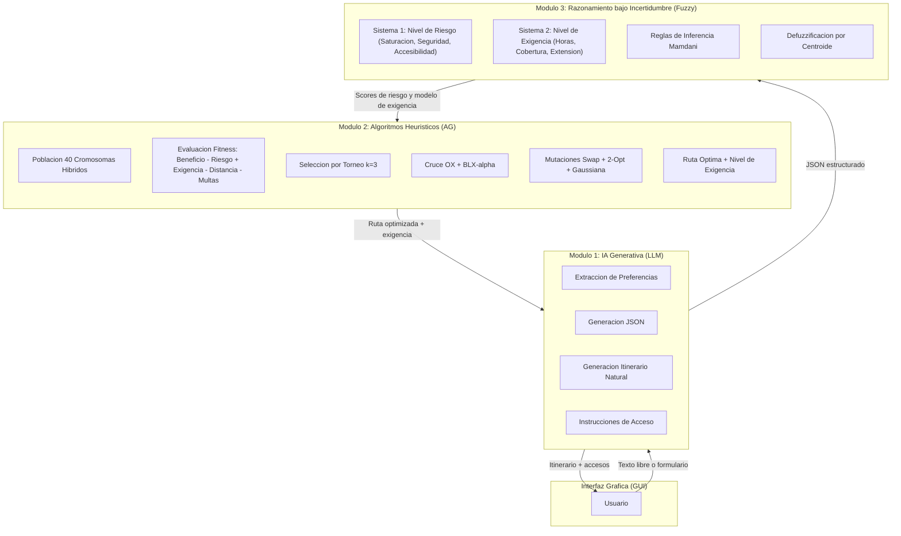
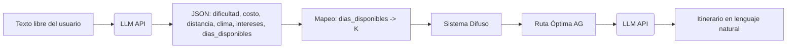
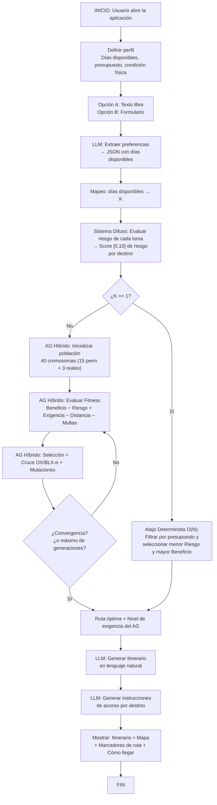
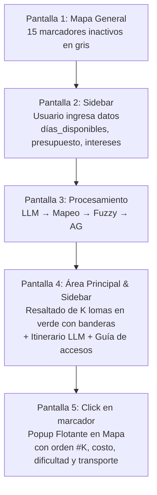
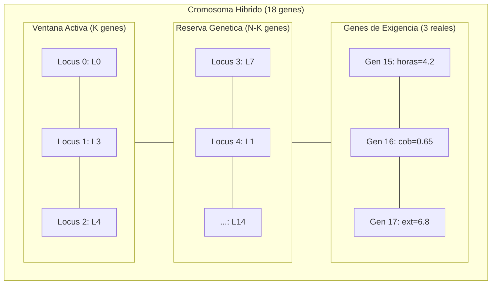
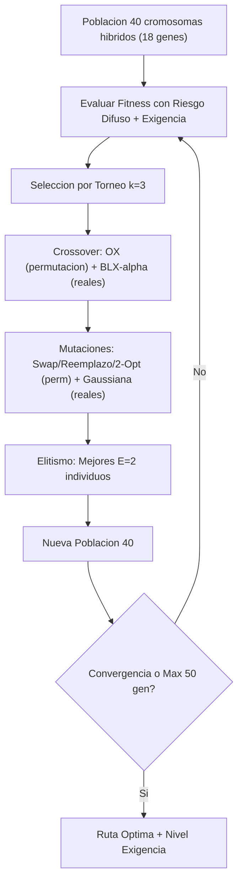
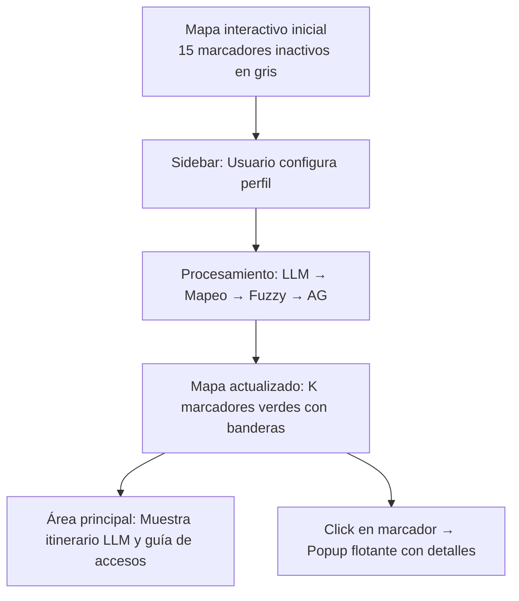
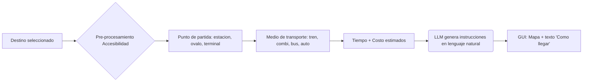

# Sistema Inteligente de Optimización de Rutas de Trekking en las Lomas de Lima

## 1. Introducción y Problemática

### 1.1 Contexto General: Concentración Turística en el Perú

El turismo en el Perú se encuentra fuertemente concentrado en un reducido número de destinos icónicos —Machu Picchu, Cusco, Islas Ballestas— lo que genera saturación, deterioro del patrimonio, congestión operativa y una distribución económica desigual entre regiones. Mientras estos destinos superan su capacidad de carga turística, otros atractivos de igual valor cultural o natural permanecen subutilizados. Este fenómeno no solo afecta a la economía regional, sino que también genera degradación ambiental en los puntos más visitados y abandón en los menos conocidos.

### 1.2 Problema Específico: Las Lomas de Lima como Áreas Verdes Subutilizadas

Lima, con aproximadamente 70,000 hectáreas de lomas distribuidas en 10 distritos, posee un ecosistema único: las **lomas costeras** son formaciones vegetales que florecen durante la temporada de **garúa** (junio–octubre), cuando la niebla del océano Pacífico permite el desarrollo de flora y fauna endémica en medio del desierto. Este ecosistema es gestionado por el **Área de Conservación Regional (ACR) Sistema de Lomas de Lima**, creada en 2019 con meta de conservación para 2042, y administrada por el Gobierno Regional de Lima Metropolitana (GRML).

Sin embargo, existen problemas significativas:

- **Turismo concentrado en pocos destinos urbanos**: Los visitantes se aglomeran en Miraflores, Barranco y el Centro Histórico, ignorando las lomas de Lima que ofrecen trekking real, biodiversidad endémica y experiencias de conexión con la naturaleza.
- **Falta de sistemas de recomendación inteligentes**: No existe ninguna aplicación peruana que combine información de rutas de trekking, recomendaciones personalizadas y planificación de itinerarios para las lomas de Lima. La app chilena *Andeshandbook* de SERNATUR cubre rutas de montaña, pero no el ecosistema de lomas limeñas.
- **Acceso logístico complejo**: Las lomas de Lima están distribuidas en distritos alejados del centro y su acceso requiere combinar transporte público (tren eléctrico, combis, buses), lo que desincentiva la visita even cuando el destino es atractivo.
- **Ecosistemas amenazados**: Las lomas enfrentan invasiones, tráfico de terrenos y construcción ilegal, lo que pone en riesgo un patrimonio natural irremplazable. El proyecto EbA Lomas de la UNDP promueve el ecoturismo sostenible como alternativa económica para las comunidades locales.

### 1.3 Necesidad de un Sistema Inteligente Integrado

Para abordar estos problemas, se requiere un sistema que no solo optimize rutas de trekking, sino que también:

- **Interprete las preferencias del usuario** en lenguaje natural (texto libre).
- **Razone bajo incertidumbre** sobre las condiciones de cada loma (seguridad, clima, accesibilidad).
- **Optimice la selección y orden de destinos** mediante algoritmos heurísticos.
- **Genere un itinerario comprensible** en lenguaje natural con instrucciones de acceso.
- **Proporcione información de cómo llegar** a cada destino, incluyendo rutas de transporte.

---

## 2. Propuesta de Solución

### 2.1 Visión General

Se propone el desarrollo de un **Software Inteligente de Optimización de Rutas de Trekking en las Lomas de Lima**, una aplicación web con interfaz gráfica que integra tres componentes complementarios: **Inteligencia Artificial Generativa (LLM)**, **Algoritmos Heurísticos (Algoritmo Genético)** y **Razonamiento bajo Incertidumbre (Lógica Difusa)**.

El sistema permite al usuario expresar sus preferencias turísticas de forma flexible (ya sea mediante un formulario estructurado o escribiendo en texto libre), evalúa las condiciones de cada loma mediante inferencia difusa, optimiza la selección y orden de destinos mediante un algoritmo genético, y finalmente genera un itinerario claro y detallado con instrucciones de acceso en lenguaje natural.

La aplicación se implementa con un **backend FastAPI** (Python) y un **frontend SPA en React + Vite + TypeScript + Tailwind + shadcn/ui + Leaflet**, y se despliega como una app web accesible desde cualquier navegador. (La versión inicial prototipó con Streamlit + folium, conservada como interfaz heredada en `app.py`.)

### 2.2 Alcance y Delimitación


| Aspecto              | Delimitación                                                                       |
| -------------------- | ---------------------------------------------------------------------------------- |
| **Geografía**        | Lima Metropolitana y provincia de Lima (15 destinos de lomas)                      |
| **Actividad**        | Trekking y exploración de lomas                                                    |
| **Usuario**          | Turista nacional y extranjero interesado en naturaleza                             |
| **Temporada**        | Época de garúa (junio–octubre) como temporada óptima                               |
| **Tecnología**       | Python (FastAPI, scikit-fuzzy, LLM API) + TypeScript (React, Vite, shadcn/ui, Leaflet) |
| **Días disponibles** | Determina K (destinos visitables): $K = \min(\max(2, \text{días}), 6)$ para $\text{días} \ge 2$, o $K = 1$ (shortcut determinista) |
| **Stack**            | **Arquitectura Desacoplada:** Backend FastAPI (Python) + Frontend SPA estilo Google Maps (React, Vite, TypeScript, Tailwind CSS, shadcn/ui, Leaflet, pnpm) |


### 2.3 Diferenciadores Respecto a Soluciones Existentes


| Aspecto                                       | Apps existentes                    | Este proyecto                                          |
| --------------------------------------------- | ---------------------------------- | ------------------------------------------------------ |
| **Razonamiento bajo incertidumbre**           | No aplican                         | 2 sistemas difusos Mamdani (Riesgo en fitness + Exigencia en cromosoma) |
| **Optimización de rutas**                     | No optimizan (son guías estáticas) | Algoritmo Genético multiobjetivo híbrido               |
| **IA Generativa**                             | No integran                        | LLM para interpretar preferencias y generar itinerario |
| **Enfoque en lomas de Lima**                  | No existe                          | Específico y detallado                                 |
| **Instrucciones de acceso**                   | No generan rutas de transporte     | LLM genera cómo llegar a cada loma                     |
| **Sistema de recomendación adaptativo**       | No lo tienen                       | Evaluación de riesgo continuo y nivel de exigencia     |
| **Mapa interactivo con marcadores numerados** | No lo tienen                       | Folium con focus en ruta óptima y badge de orden       |
| **Planificación según días disponibles**      | No lo tienen                       | K dinámico según días\_disponibles del usuario         |


---

## 3. Arquitectura del Sistema

### 3.1 Diagrama de Arquitectura General


```mermaid
graph TB
    subgraph GUI["Interfaz Grafica (GUI)"]
        U["Usuario"]
    end
    subgraph MOD1["Modulo 1: IA Generativa (LLM)"]
        direction LR
        L1["Extraccion de Preferencias"]
        L2["Generacion JSON"]
        L3["Generacion Itinerario Natural"]
        L4["Instrucciones de Acceso"]
    end
    subgraph MOD2["Modulo 2: Algoritmos Heuristicos (AG)"]
        direction TB
        A1["Poblacion 40 Cromosomas Hibridos"]
        A2["Evaluacion Fitness: Beneficio - Riesgo + Exigencia - Distancia - Multas"]
        A3["Seleccion por Torneo k=3"]
        A4["Cruce OX + BLX-alpha"]
        A5["Mutaciones Swap + 2-Opt + Gaussiana"]
        A6["Ruta Optima + Nivel de Exigencia"]
    end
    subgraph MOD3["Modulo 3: Razonamiento bajo Incertidumbre (Fuzzy)"]
        direction TB
        F1["Sistema 1: Nivel de Riesgo (Saturacion, Seguridad, Accesibilidad)"]
        F2["Sistema 2: Nivel de Exigencia (Horas, Cobertura, Extension)"]
        F3["Reglas de Inferencia Mamdani"]
        F4["Defuzzificacion por Centroide"]
    end

    U -->|"Texto libre o formulario"| MOD1
    MOD1 -->|"JSON estructurado"| MOD3
    MOD3 -->|"Scores de riesgo y modelo de exigencia"| MOD2
    MOD2 -->|"Ruta optimizada + exigencia"| MOD1
    MOD1 -->|"Itinerario + accesos"| U
```

### 3.2 Módulo 1: IA Generativa (LLM)

**Función**: Conectado mediante API, este módulo cumple tres roles:

1. **Interpretación de solicitudes del usuario**: El usuario puede escribir en texto libre sus preferencias (ejemplo: *"Quiero un trek de media dificultad este finde, con lomas verdes, que no sea muy caro, sin ir muy lejos"*). El LLM extrae entidades estructuradas: dificultad, clima preferido, costo máximo, distancia máxima, **días disponibles**.
2. **Generación de entradas estructuradas**: Produce un JSON tipificado con los parámetros del turista, incluyendo los **días\_disponibles** que se enviará al módulo de mapeo para determinar K.
3. **Generación de resultados en lenguaje natural**: Toma la ruta óptima del AG y las instrucciones de acceso, y produce un itinerario detallado, comprensible y amigable para el usuario.

**Flujo del LLM:**


```mermaid
flowchart LR
    A[Texto libre del usuario] --> B(LLM API)
    B --> C[JSON: dificultad, costo, distancia, clima, intereses, dias_disponibles]
    C --> D[Mapeo: dias_disponibles -> K]
    D --> E[Sistema Difuso]
    E --> F[Ruta Óptima AG]
    F --> G(LLM API)
    G --> H[Itinerario en lenguaje natural]
```

### 3.3 Módulo 2: Algoritmos Heurísticos (Algoritmo Genético)

**Función**: Motor de optimización que busca, dentro del espacio combinatorio de rutas posibles, aquella que maximiza la afinidad del turista con los destinos y la diversificación turística, respetando restricciones duras de presupuesto, tiempo y temporada.

**Detalles técnicos**:

- **Tipo de problema**: Optimización combinatoria NP-hard, multiobjetivo con restricciones (Orienteering Problem / Selective TSP)
- **Representación**: Cromosoma de permutación completa ($N=15$) con ventana activa $K$ (fenotipo evaluado).
- **Operadores**: Selección por torneo, cruce ordenado (Order Crossover, OX) sobre el genotipo completo, mutaciones compuestas y elitismo.
- **Bifurcación de control**: Si $K = 1$, ejecuta un atajo determinista en $O(N)$ omitiendo el AG.

Se detalla en la sección 6.

### 3.4 Módulo 3: Razonamiento bajo Incertidumbre (Lógica Difusa)

**Función**: El módulo de lógica difusa integra **dos sistemas de inferencia Mamdani** que se acoplan directamente al Algoritmo Genético:

1. **Sistema de Nivel de Riesgo** (en la función fitness): Evalúa el riesgo operacional de cada loma mediante **3 variables de incertidumbre** (Saturación Turística, Seguridad Percibida y Accesibilidad Cualitativa), produciendo un $\text{nivel\_riesgo} \in [0, 10]$ que penaliza la aptitud de las rutas con destinos riesgosos.

2. **Sistema de Nivel de Exigencia de Exploración** (en la cadena genética): Evalúa qué tan intensiva es la exploración del turista mediante **3 variables codificadas como genes reales** dentro del cromosoma (Horas de Recorrido, Cobertura de Zona y Extensión del Circuito), produciendo un $\text{nivel\_exigencia} \in [0, 1]$ que bonifica y modula la tolerancia al riesgo.

Las variables deterministas como **Costo** (Soles) y **Distancia de Desplazamiento Radial** ($d_0 \to d_j$ en km) se delegan al Algoritmo Genético como funciones de costo real y restricciones duras ($\Omega_{\text{presupuesto}}$, $\Omega_{\text{tiempo}}$), garantizando una estricta separación de responsabilidades.

Se detalla en la sección 5 y en el documento complementario [`docs/integrar_difuso.md`](docs/integrar_difuso.md).

### 3.5 Flujo End-to-End del Sistema


```mermaid
flowchart TD
    A["INICIO: Usuario abre la aplicación"] --> B["Definir perfil<br/>Días disponibles, presupuesto, condición física"]
    B --> C["Opción A: Texto libre<br/>Opción B: Formulario"]
    C --> D["LLM: Extraer preferencias<br/>→ JSON con días disponibles"]
    D --> E["Mapeo: días disponibles → K"]
    E --> F["Sistema Difuso: Evaluar riesgo de cada loma<br/>→ Score [0,10] de riesgo por destino"]
    F --> K_CHECK{"¿K == 1?"}
    K_CHECK -->|Sí| SHORTCUT["Atajo Determinista O(N):<br/>Filtrar por presupuesto y<br/>seleccionar menor Riesgo y mayor Beneficio"]
    K_CHECK -->|No| G["AG Híbrido: Inicializar población<br/>40 cromosomas (15 perm + 3 reales)"]
    G --> H["AG Híbrido: Evaluar Fitness<br/>Beneficio − Riesgo + Exigencia − Distancia − Multas"]
    H --> I["AG Híbrido: Selección + Cruce OX/BLX-α + Mutaciones"]
    I --> J{"¿Convergencia?<br/>¿o máximo de generaciones?"}
    J -->|No| H
    J -->|Sí| K["Ruta óptima + Nivel de exigencia del AG"]
    SHORTCUT --> K
    K --> L["LLM: Generar itinerario<br/>en lenguaje natural"]
    L --> M["LLM: Generar instrucciones<br/>de acceso por destino"]
    M --> N["Mostrar: Itinerario + Mapa<br/>+ Marcadores de ruta + Cómo llegar"]
    N --> O["FIN"]
```

### 3.6 Flujo de Interacción del Usuario

La interfaz se divide en **dos paneles**: una barra lateral (sidebar) para los controles de entrada del perfil del turista, y un área principal donde se muestran el mapa interactivo generado con `folium` y los resultados detallados (itinerario LLM y guía de acceso).


```mermaid
flowchart TD
    P1["Pantalla 1: Mapa General<br/>15 marcadores inactivos en gris"] --> P2["Pantalla 2: Sidebar<br/>Usuario ingresa datos<br/>días_disponibles, presupuesto, intereses"]
    P2 --> P3["Pantalla 3: Procesamiento<br/>LLM → Mapeo → Fuzzy → AG"]
    P3 --> P4["Pantalla 4: Área Principal & Sidebar<br/>Resaltado de K lomas en verde con banderas<br/>+ Itinerario LLM + Guía de accesos"]
    P4 --> P5["Pantalla 5: Click en marcador<br/>Popup Flotante en Mapa<br/>con orden #K, costo, dificultad y transporte"]
```

**Descripción de cada pantalla:**


| Pantalla | Contenido                                                                                                | Ubicación               |
| -------- | -------------------------------------------------------------------------------------------------------- | ----------------------- |
| 1        | Mapa interactivo inicial con los 15 marcadores de lomas (color gris inactivo)                            | Área principal          |
| 2        | Sidebar con controles: Selección de modo (Texto Libre / Formulario), días, presupuesto y preferencias   | Barra lateral           |
| 3        | Indicador de estado/progreso del pipeline: LLM → Mapeo → Fuzzy → AG/Shortcut                             | Barra lateral / Principal |
| 4        | Mapa con K lomas resaltadas en verde con banderas de orden + Panel con itinerario LLM y accesos          | Área principal          |
| 5        | Click en marcador → Popup Flotante de Folium con detalles del lugar (#Orden, Distrito, Costo, Transporte) | Mapa (Popup flotante)   |


**Interacciones confirmadas:**

- El usuario puede presionar cualquier marcador en el mapa para desplegar su Popup Flotante con información detallada.
- Los $K$ destinos seleccionados en la ruta óptima se destacan visualmente con color verde y banderas (`fa-flag`), mientras que los destinos restantes permanecen en el mapa en tono gris.
- El usuario puede reajustar los parámetros en el sidebar y volver a ejecutar la optimización en cualquier momento.
- El usuario puede volver a ingresar datos y generar una nueva ruta óptima mediante el algoritmo
- **No se incluye chat** — toda la información se muestra estructurada en la sidebar

---

## 4. Catálogo de Destinos Turísticos

### 4.1 Tabla de Destinos


| ID  | Destino                         | Distrito   | Tipo                    | Dificultad    | Distancia desde C. | Ej. Saturación | Acceso principal       |
| --- | ------------------------------- | ---------- | ----------------------- | ------------- | ------------------ | -------------- | ---------------------- |
| L0  | Lomas del Paraíso (+ Apu Siqay) | VMT        | Naturaleza/Trekking     | Moderado      | \~1h               | 0.15           | Tren eléctrico + combi |
| L1  | Lomas de Carabayllo 2           | Carabayllo | Naturaleza/Trekking     | Fácil-Difícil | \~1.5h             | 0.20           | Bus + caminata         |
| L2  | Lomas de Primavera              | Carabayllo | Naturaleza/Trekking     | Fácil         | \~1h               | 0.10           | Bus                    |
| L3  | Lomas de Manchay                | Ate        | Naturaleza              | Moderado      | \~45 min           | 0.08           | Bus                    |
| L4  | Lomas de Mangomarca             | SJL        | Naturaleza/Arqueología  | Moderado      | \~1h               | 0.15           | Bus                    |
| L5  | Lomas de Amancaes               | Rímac      | Naturaleza              | Fácil         | \~40 min           | 0.45           | Corredor Azul          |
| L6  | Lomas de Lachay (Reserva)       | Huarochirí | Naturaleza/Reserva      | Fácil-Mod     | \~2h               | 0.50           | Bus/auto               |
| L7  | Lomas de Lúcumo                 | Pachacamac | Naturaleza/Arqueología  | Fácil         | \~1h               | 0.45           | Panamericana Sur       |
| L8  | Morro Solar                     | Chorrillos | Naturaleza/Vista        | Fácil         | \~30 min           | 0.70           | Metro + bus            |
| L9  | Huaca Pucllana                  | Miraflores | Cultural/Arqueología    | Muy fácil     | \~15 min           | 0.85           | Metro                  |
| L10 | Parque de la Reserva            | San Isidro | Naturaleza/Urbano       | Muy fácil     | \~10 min           | 0.65           | Metro                  |
| L11 | Lomas de Ancón                  | Ancón      | Naturaleza/Conservación | Fácil         | \~45 min           | 0.12           | Bus                    |
| L12 | Quebrada de Huaycoloro          | Lurín      | Naturaleza/Cañón        | Moderado      | \~1h               | 0.18           | Bus                    |
| L13 | Cerro de la Estrella            | Ate        | Naturaleza/Vista        | Fácil         | \~40 min           | 0.40           | Metro + bus            |
| L14 | La Loma Amarilla                | Surco      | Naturaleza/Urbano       | Muy fácil     | \~20 min           | 0.55           | Metro                  |


### 4.2 Detalle de Accesos por Destino

Cada destino cuenta con información de acceso que se integra como un **módulo complementario** de pre-procesamiento. Esta información alimenta la variable difusa de **Accesibilidad** y es utilizada por el LLM para generar instrucciones de viaje.

**Ejemplo: Lomas del Paraíso (+ Apu Siqay)**

- Punto de partida: Estación María Auxiliadora (Tren Eléctrico)
- Medio de transporte: Tren → Combi
- Distancia al ingreso: 13 km (tren) + 7.8 km (combi)
- Tiempo estimado: \~48 min
- Costo estimado: \~S/4.50
- Nota: Circuito Ecoturístico con guías disponibles desde 2013

**Ejemplo: Lomas de Carabayllo 2**

- Sistema de reservas en: lomas.perupos.com
- 4 rutas oficiales con control de aforo:
  - Ruta Para Todos (Fácil, 30 min)
  - Ruta del Colchón Ancestral (Moderado, 150 min)
  - Ruta El Brujo (Fácil, 60 min)
  - Ruta del Zorro Místico (Difícil, 270 min)
- Punto de partida: Ingreso al ACR Sistema de Lomas de Lima

### 4.3 Nota sobre las Lomas Adicionales

El ACR Sistema de Lomas de Lima (creado en 2019, meta 2042) abarca las lomas de **Ancón, Carabayllo 1 y 2, Amancaes y Villa María del Triunfo**, administradas por el GRML. Lima cuenta con aproximadamente **70,000 hectáreas de lomas** según el IMP y SERPAR. Fuera del ACR se encuentran Lomas de Lachay, Lúcumo, Mangomarca y Manchay, todas incluidas en el catálogo.

---

### 5. Lógica Difusa (Razonamiento bajo Incertidumbre)

### 5.1 Descripción del Sistema y Justificación Arquitectónica

El módulo de lógica difusa implementa **dos sistemas de inferencia Mamdani** integrados directamente en el Algoritmo Genético, siguiendo las indicaciones del docente de incorporar un componente de lógica difusa en la **cadena genética** y otro en la **función fitness**:

| Sistema Difuso | Ubicación en el AG | Variables de Entrada | Variable de Salida | Propósito |
|:---------------|:-------------------|:---------------------|:-------------------|:----------|
| **Nivel de Riesgo** | Función Fitness | Saturación, Seguridad, Accesibilidad (3 vars) | `nivel_riesgo` ∈ [0, 10] | Penalizar lomas riesgosas |
| **Nivel de Exigencia** | Cadena Genética (cromosoma) | Horas, Cobertura, Extensión (3 vars) | `nivel_exigencia` ∈ [0, 1] | Modelar intensidad de exploración |

> **Decisión de Diseño — Cambio de "calidad" a "riesgo":**
> Se reemplazó el sistema de "calidad de las lomas" (variable de salida `recomendacion`) por un sistema de **"nivel de riesgo de las lomas"** (variable de salida `nivel_riesgo`), siguiendo la observación del docente de que el concepto de riesgo es más utilizado en la literatura de optimización de rutas. La variable de **clima/verdor** se eliminó del sistema difuso porque no tiene relación directa con el concepto de riesgo operacional; el clima se reserva para información complementaria del itinerario LLM.

### 5.2 Sistema Difuso 1: Nivel de Riesgo de las Lomas (Función Fitness)

Este sistema evalúa el riesgo operacional de cada loma del catálogo. Un score de riesgo **alto** implica que la loma es más riesgosa y por tanto será **penalizada** en la función fitness (el AG tenderá a evitarla).

#### V1: Saturación Turística

- **Qué mide**: Nivel de afluencia turística concurrente del destino.
- **Universo de discurso**: Escala normalizada $[0.0, 1.0]$ (0 = vacío, 1 = saturación máxima).
- **Términos lingüísticos**:
  - `Baja`: $[0.0, 0.4]$ — Lomas poco concurridas (Paraíso, Primavera, Manchay).
  - `Media`: $[0.3, 0.7]$ — Concurrencia habitual (Amancaes, Lúcumo).
  - `Alta`: $[0.6, 1.0]$ — Destinos urbanos o reservas masivas (Morro Solar, Huaca Pucllana).
- **Relación con riesgo**: Alta saturación → **mayor riesgo** de deterioro ecológico, incidentes en senderos congestionados y dificultad de evacuación. Este eje es central al problema de la saturación turística de las lomas de Lima.

#### V2: Seguridad Percibida

- **Qué mide**: Percepción cualitativa de seguridad ciudadana en el entorno de la loma y sus accesos.
- **Universo de discurso**: Escala $[0, 10]$ (0 = muy riesgoso, 10 = muy seguro).
- **Términos lingüísticos**:
  - `Riesgoso`: $[0, 4]$ — Zonas periféricas con baja presencia policial.
  - `Moderado`: $[3, 7]$ — Zonas con vigilancia vecinal o acceso semiregulado.
  - `Seguro`: $[6, 10]$ — Circuitos cerrados, áreas de conservación con personal.
- **Relación con riesgo**: Baja seguridad → **mayor riesgo** de incidentes para el turista.

#### V3: Accesibilidad Cualitativa

- **Qué mide**: Grado de facilidad o complejidad para acceder al inicio del sendero.
- **Universo de discurso**: Escala $[0, 10]$ (0 = muy complejo, 10 = acceso directo).
- **Términos lingüísticos**:
  - `Difícil`: $[0, 4]$ — Múltiples trasbordos informales, trochas no señalizadas.
  - `Media`: $[3, 7]$ — Conexión mediante bus o combi y senderos moderadamente señalizados.
  - `Fácil`: $[6, 10]$ — Acceso directo vía Metro Línea 1, Corredores Complementarios.
- **Relación con riesgo**: Baja accesibilidad → **mayor riesgo** de accidentes en el trayecto.

#### Salida: Nivel de Riesgo

- **Variable de salida**: $\text{nivel\_riesgo} \in [0, 10]$.
  - Conjuntos: `Muy_Bajo` $[0, 2.5]$, `Bajo` $[2, 4.5]$, `Medio` $[4, 7]$, `Alto` $[6.5, 9]$, `Muy_Alto` $[8, 10]$.
- **Método de defuzzificación**: Centroide (Center of Gravity).
- **Semántica invertida**: A diferencia del antiguo sistema de "calidad" donde un score alto era deseable, aquí un **score alto significa mayor riesgo** y se **resta** del fitness.

---

### 5.3 Sistema Difuso 2: Nivel de Exigencia de Exploración (Cadena Genética)

Este sistema modela la intensidad de la exploración del turista. Sus 3 variables de entrada están **codificadas como genes reales** dentro del cromosoma del AG (genes 15, 16 y 17), lo que permite que el AG evolucione no solo qué lomas visitar y en qué orden, sino también con qué nivel de exigencia explorarlas.

#### E1: Horas de Recorrido

- **Qué mide**: Tiempo dedicado a explorar la zona.
- **Universo de discurso**: $[1, 6]$ horas (basado en datos reales del catálogo: mínimo 2.0h, máximo 6.0h, promedio 3.5h).
- **Términos lingüísticos**: `Corto` $[1, 3]$, `Moderado` $[2, 5]$, `Extenso` $[4, 6]$.

#### E2: Cobertura de Zona

- **Qué mide**: Porcentaje de la zona que se cubrirá.
- **Universo de discurso**: $[0.0, 1.0]$ (0.25 = un mirador, 0.5 = circuito corto, 1.0 = cobertura total).
- **Términos lingüísticos**: `Parcial` $[0, 0.35]$, `Intermedia` $[0.25, 0.75]$, `Completa` $[0.6, 1.0]$.

#### E3: Extensión del Circuito

- **Qué mide**: Longitud del circuito de senderismo.
- **Universo de discurso**: $[1, 10]$ km (basado en datos reales: Lúcumo circuito largo 7 km, Paraíso ~2.6 km, Lachay 5 km).
- **Términos lingüísticos**: `Corto` $[1, 4.5]$, `Medio` $[3, 8]$, `Largo` $[6.5, 10]$.

#### Salida: Nivel de Exigencia

- **Variable de salida**: $\text{nivel\_exigencia} \in [0.0, 1.0]$.
  - Conjuntos: `Relajado` $[0, 0.35]$, `Moderado` $[0.25, 0.75]$, `Intenso` $[0.65, 1.0]$.
- **Método de defuzzificación**: Centroide.
- **Rol en el fitness**: El nivel de exigencia bonifica la aptitud del individuo y modula su tolerancia al riesgo (un turista más exigente acepta lomas con mayor riesgo a cambio de una exploración más profunda).

La documentación técnica completa de ambos sistemas difusos, con diagramas, reglas y ejemplos paso a paso, se encuentra en [`docs/integrar_difuso.md`](docs/integrar_difuso.md).

---

### 5.4 Base de Reglas del Sistema de Riesgo (~16 Reglas)

El motor de inferencia evalúa reglas con la lógica **invertida** respecto al antiguo sistema de calidad:
`SI (Saturación es ...) Y (Seguridad es ...) Y (Accesibilidad es ...) ENTONCES (Riesgo es ...)`

```text
-- RIESGO MUY ALTO (condiciones críticas)
R01: SI Seguridad=Riesgoso Y Accesibilidad=Dificil                            ENTONCES Riesgo=Muy_Alto
R02: SI Saturacion=Alta Y Seguridad=Riesgoso                                  ENTONCES Riesgo=Muy_Alto

-- RIESGO ALTO (condiciones desfavorables)
R03: SI Saturacion=Alta Y Seguridad=Moderado Y Accesibilidad=Media            ENTONCES Riesgo=Alto
R04: SI Saturacion=Media Y Seguridad=Riesgoso Y Accesibilidad=Media           ENTONCES Riesgo=Alto
R05: SI Saturacion=Alta Y Seguridad=Moderado Y Accesibilidad=Dificil          ENTONCES Riesgo=Alto
R06: SI Saturacion=Media Y Seguridad=Riesgoso Y Accesibilidad=Dificil         ENTONCES Riesgo=Alto

-- RIESGO MEDIO (condiciones mixtas)
R07: SI Saturacion=Media Y Seguridad=Moderado Y Accesibilidad=Media           ENTONCES Riesgo=Medio
R08: SI Saturacion=Alta Y Seguridad=Seguro Y Accesibilidad=Facil              ENTONCES Riesgo=Medio
R09: SI Saturacion=Media Y Seguridad=Seguro Y Accesibilidad=Dificil           ENTONCES Riesgo=Medio
R10: SI Saturacion=Baja Y Seguridad=Riesgoso Y Accesibilidad=Facil            ENTONCES Riesgo=Medio

-- RIESGO BAJO (condiciones favorables)
R11: SI Saturacion=Baja Y Seguridad=Moderado Y Accesibilidad=Facil            ENTONCES Riesgo=Bajo
R12: SI Saturacion=Baja Y Seguridad=Seguro Y Accesibilidad=Media              ENTONCES Riesgo=Bajo
R13: SI Saturacion=Baja Y Seguridad=Moderado Y Accesibilidad=Media            ENTONCES Riesgo=Bajo
R14: SI Saturacion=Media Y Seguridad=Seguro Y Accesibilidad=Facil             ENTONCES Riesgo=Bajo

-- RIESGO MUY BAJO (condiciones óptimas)
R15: SI Saturacion=Baja Y Seguridad=Seguro Y Accesibilidad=Facil              ENTONCES Riesgo=Muy_Bajo
R16: SI Saturacion=Baja Y Seguridad=Seguro Y Accesibilidad=Dificil            ENTONCES Riesgo=Muy_Bajo
```

---

### 6. Algoritmo Genético

### 6.1 Fundamentos Conceptuales: Gen, Cromosoma y Población

Para que el modelo sea comprensible a simple vista, el Algoritmo Genético modela el problema como la organización de un itinerario de viaje grupal:

#### A. El Gen (La Parada Individual)
Es la unidad mínima de información dentro de la solución:

| Elemento del Gen | Concepto Biológico | Equivalente en el Proyecto | Ejemplo Concreto |
| :--- | :--- | :--- | :--- |
| **Locus** | Posición física en el cromosoma | Día u orden de visita en el itinerario | Posición 0 (Día 1 del viaje) |
| **Alelo** | Variante o valor del gen | Código único de la loma asignada | `L0` |
| **Fenotipo** | Rasgo visible manifestado | Destino turístico real que se visita | Lomas del Paraíso (Villa María del Triunfo) |
| **Interpretación** | Información de un rasgo biológico | Instrucción operativa de viaje | *"El primer día del itinerario se visita Lomas del Paraíso"* |

#### B. El Cromosoma Híbrido (Permutación $N=15$ + 3 Genes Reales de Exigencia)
El genotipo se define como un **cromosoma híbrido de 18 genes** que combina:
1. **Permutación de lomas (genes 0-14):** Los 15 alelos del catálogo organizados bajo la representación basada en prefijos.
   - **Ventana Activa ($K$ lomas titulares):** Las primeras $K$ lomas que el turista va a recorrer.
   - **Reserva Durmiente ($15 - K$ suplentes):** Lomas en lista de espera.
2. **Genes reales de exigencia (genes 15-17):** 3 valores de punto flotante que codifican las variables de entrada del sistema difuso de **Nivel de Exigencia de Exploración**:
   - Gen 15: `horas_recorrido` ∈ [1.0, 6.0]
   - Gen 16: `cobertura_zona` ∈ [0.0, 1.0]
   - Gen 17: `extension_circuito` ∈ [1.0, 10.0] km

> **Garantía de Validez Matemática del Crossover:** La parte de permutación (genes 0-14) se cruza con **Order Crossover (OX)** estándar. Los genes reales (15-17) se cruzan con **BLX-α** (blend crossover). Esta separación garantiza que ambos segmentos del cromosoma mantengan su validez semántica.

**Ejemplo de Cromosoma Híbrido para un viaje de 3 días ($K = 3$):**

| Posición (Locus) | Código (Alelo) | Nombre / Descripción | Tipo de Gen | Rol en el Cromosoma | ¿Evaluado? |
| :---: | :---: | :--- | :--- | :--- | :---: |
| **0** | `L0` | Lomas del Paraíso (+ Apu Siqay) | Discreto | **Día 1 (Titular)** | **Sí** |
| **1** | `L3` | Lomas de Manchay | Discreto | **Día 2 (Titular)** | **Sí** |
| **2** | `L4` | Lomas de Mangomarca | Discreto | **Día 3 (Titular)** | **Sí** |
| **3** | `L7` | Lomas de Lúcumo | Discreto | Suplente 1 (Reserva) | No |
| **...** | ... | ... | ... | ... | No |
| **14** | `L14` | La Loma Amarilla | Discreto | Suplente 12 (Reserva) | No |
| **15** | `4.2` | Horas de recorrido | **Real [1, 6]** | **Gen de Exigencia** | **Sí** |
| **16** | `0.65` | Cobertura de zona | **Real [0, 1]** | **Gen de Exigencia** | **Sí** |
| **17** | `6.8` | Extensión del circuito (km) | **Real [1, 10]** | **Gen de Exigencia** | **Sí** |


```mermaid
flowchart LR
    subgraph Genotipo["Cromosoma Hibrido (18 genes)"]
        direction LR
        subgraph Activos["Ventana Activa (K genes)"]
            G1["Locus 0: L0"] --- G2["Locus 1: L3"] --- G3["Locus 2: L4"]
        end
        subgraph Reserva["Reserva Genetica (N-K genes)"]
            G4["Locus 3: L7"] --- G5["Locus 4: L1"] --- G6["...: L14"]
        end
        subgraph Exigencia["Genes de Exigencia (3 reales)"]
            G7["Gen 15: horas=4.2"] --- G8["Gen 16: cob=0.65"] --- G9["Gen 17: ext=6.8"]
        end
        Activos --- Reserva --- Exigencia
    end
```

*Conclusión del Cromosoma Híbrido:* El AG optimiza simultáneamente **qué lomas visitar** (permutación), **en qué orden** (posición en ventana K) y **con qué nivel de exigencia explorarlas** (genes reales → sistema difuso Mamdani → `nivel_exigencia`).

#### C. La Población (Los 40 Planes de Viaje Compitiendo)
La población es el conjunto de **40 itinerarios alternativos** generados al inicio de forma aleatoria:

| Individuo | Itinerario Activo ($K = 3$) | Lomas en Reserva (Suplentes) | Diagnóstico del Plan | Calidad Inicial Estimada |
| :---: | :--- | :--- | :--- | :--- |
| **Plan 1** | Paraíso $\to$ Manchay $\to$ Mangomarca | Lúcumo, Amancaes, Ancón, ... | Lomas cercanas al nodo base, gasto bajo (S/ 35). | **Alta (Candidato a Campeón)** |
| **Plan 2** | Lúcumo $\to$ Ancón $\to$ Lachay | Paraíso, Carabayllo, Primavera, ... | Muy distantes del centro (>120 km radiales), pasajes muy caros. | **Baja (Se extinguirá rápido)** |
| **Plan 3** | Carabayllo $\to$ Primavera $\to$ Amancaes | Lúcumo, Manchay, Paraíso, ... | Concentradas en Lima Norte, costo intermedio. | **Media (Mejorable con cruce)** |
| **...** | *(37 planes adicionales generados)* | ... | ... | ... |

---

### 6.2 Mapeo Temporal Urbano Dinámico y Atajo Determinista

1. **Mapeo Urbano Dinámico ($K = \min(\max(2, \text{días}), 6)$):**  
   En Lima Metropolitana, el senderismo en lomas se realiza como una excursión diurna con un destino por día. Por tanto, para $\text{días} \ge 2$, se asigna $K = \text{días}$ acotado a un mínimo de 2 (para garantizar un espacio de búsqueda combinatorio formal) y un máximo de 6 lomas visitables. Esto permite la exploración del AG y el cómputo de distancias relativas.
2. **Bifurcación de Control para Horizonte Unitario ($K = 1$):**  
   Cuando el usuario declara disponer de un solo día ($K = 1$), el orquestador implementa un **atajo condicional (shortcut determinista en $O(N)$)** que omite la ejecución del algoritmo bioinspirado. El sistema filtra el catálogo por presupuesto y retorna de forma determinista la loma con el mayor score difuso ($S_{\text{difuso}}$), evitando sobrecosto computacional redundante de 50 generaciones.

---

### 6.3 La Función Fitness (Aptitud) con Riesgo Difuso, Exigencia y Escalado Relativo

Antes de cualquier fórmula matemática, el fitness representa la **calificación general del viaje** según la siguiente regla en palabras:

$$
\mathbf{Nota\ del\ Viaje\ (Fitness)} = (\text{Beneficio\ Base}) + (\text{Bonificación\ por\ Exigencia}) - (\text{Penalización\ por\ Riesgo}) - (\text{Costo\ de\ Desplazamiento}) - (\text{Multas\ de\ Presupuesto\ y\ Tiempo})
$$

#### A. Integración de los 2 Componentes de Lógica Difusa

- **Componente 1 (Cadena Genética):** Los genes reales del cromosoma (horas, cobertura, extensión) se procesan por el motor Mamdani de Exigencia para producir un `nivel_exigencia ∈ [0, 1]`. Este valor **bonifica** el fitness y **modula la tolerancia al riesgo**.
- **Componente 2 (Función Fitness):** El `nivel_riesgo ∈ [0, 10]` de cada loma (calculado por el motor Mamdani de Riesgo a partir de saturación, seguridad y accesibilidad) **penaliza** el fitness acumulativamente.

#### B. Costo de Desplazamiento Radial ($d_0 \to d_j$)
Se utiliza la métrica Haversine de **viajes radiales independientes desde el nodo base del usuario ($d_0$)** hacia cada loma $d_j$, modelando el retorno diario al alojamiento.

#### C. Escalado Adimensional Relativo en Penalizaciones
Las penalizaciones de presupuesto y tiempo utilizan **barreras relativas normalizadas $(\Delta / \text{Límite})^2$** para evitar la distorsión de escala.

#### Tabla de Criterios: ¿Qué suma puntos y qué resta puntos?

| Criterio Evaluado | Efecto | ¿Cómo se calcula? | Justificación |
| :--- | :---: | :--- | :--- |
| **Beneficio Base de las Lomas** | **Suma (+)** | Puntaje intrínseco de cada loma basado en tipo, temporada y patrimonio. | El turista busca lomas atractivas con experiencias valiosas. |
| **Bonificación por Exigencia** | **Suma (+)** | $\delta \times \text{nivel\_exigencia}$ del sistema difuso del cromosoma. | Premia exploración profunda; el AG evoluciona el estilo óptimo. |
| **Penalización por Riesgo** | **Resta (-)** | $\gamma \times \Sigma\,\text{riesgo\_difuso}(d_j) \times \text{factor\_tolerancia}$. | Un turista exigente acepta más riesgo; uno relajado lo evita. |
| **Costo de Desplazamiento Radial** | **Resta (-)** | $\beta \cdot (\text{Distancia} / 100)$ por Haversine desde $d_0$. | Refleja el traslado diario ida y vuelta desde el alojamiento. |
| **Multa Relativa de Presupuesto** | **Castiga (-)** | $\lambda_1 \cdot (\Delta_{\text{presupuesto}} / \text{Presupuesto})^2$. | Normaliza el exceso monetario de forma adimensional. |
| **Multa Relativa de Tiempo** | **Castiga (-)** | $\lambda_2 \cdot (\Delta_{\text{tiempo}} / \text{TiempoDisponible})^2$. | Evalúa las horas útiles diarias ($8\text{h}/\text{día}$). |

#### Ejemplo Numérico Paso a Paso

Supongamos un usuario con **S/ 60.00 de presupuesto**, **3 días** ($K=3$), cromosoma con genes reales `[horas=4.2, cob=0.65, ext=6.8]`.

Evaluemos el **Plan 1** (`L4: Mangomarca` $\to$ `L3: Manchay` $\to$ `L0: Paraíso`):

| Paso | Concepto Evaluado | Datos y Cálculo | Puntos |
| :---: | :--- | :--- | :---: |
| **1** | **Componente 1: Nivel de Exigencia** | Genes reales (4.2, 0.65, 6.8) → Motor Mamdani → `nivel_exigencia = 0.58` | — |
| **2** | **Beneficio Base** | Mangomarca (7.0) + Manchay (6.5) + Paraíso (7.5) = 21.0 | **+21.00** |
| **3** | **Penalización Exigencia** | $\delta \times (0.58 - 0.50)^2 = 2.0 \times 0.0064$ | **-0.01** |
| **4** | **Componente 2: Riesgo Difuso** | L4 riesgo=2.8 + L3 riesgo=3.5 + L0 riesgo=2.2 = 8.5 | — |
| **5** | **Penalización Riesgo** | $\gamma \times (8.5/10) \times (1 - 0.58 \times 0.2) = 1.5 \times 0.85 \times 0.884$ | **-1.13** |
| **6** | **Desplazamiento Radial** | 42.0 km total → $1.0 \times (42/100)$ | **-0.42** |
| **7** | **Presupuesto** | S/ 35 ≤ S/ 60 → Sin exceso | **-0.00** |
| **8** | **Tiempo** | 12h ≤ 24h útiles → Sin exceso | **-0.00** |
| **FINAL** | **Fitness** | $21.00 - 0.01 - 1.13 - 0.42 - 0.00 - 0.00$ | **19.44** |

#### Formulación Matemática Formal

$$
\boxed{F(x) = \sum_{j=1}^{K} B(d_j) \;-\; \delta \cdot (E_{\text{exig}} - E^{*})^2 \;-\; \gamma \cdot \frac{\sum_{j=1}^{K} R_{\text{riesgo}}(d_j)}{10} \cdot (1 - E_{\text{exig}} \cdot 0.2) \;-\; \beta \cdot \frac{\text{Dist}(x)}{100} \;-\; \lambda_1 \cdot \left(\frac{\Delta_P}{P}\right)^2 \;-\; \lambda_2 \cdot \left(\frac{\Delta_T}{T}\right)^2 \;-\; \Omega_u}
$$

Donde:
- $B(d_j)$: Beneficio base intrínseco de la loma $d_j$.
- $E_{\text{exig}} \in [0, 1]$: Nivel de exigencia difuso, obtenido del **Componente 1** (genes reales del cromosoma → Mamdani).
- $R_{\text{riesgo}}(d_j) \in [0, 10]$: Nivel de riesgo difuso de la loma, obtenido del **Componente 2** (datos de la loma → Mamdani).
- $\delta = 2.0$: Peso de la penalización por desvío de exigencia respecto al objetivo $E^{*} = 0.50$.
- $\gamma = 1.5$: Peso de penalización por riesgo.
- $\beta = 1.0$, $\lambda_1 = 25.0$, $\lambda_2 = 25.0$: Pesos de distancia, presupuesto y tiempo.
- $\Omega_u = 1000 \cdot (K - |\text{set}(x_{1..K})|)$: Salvaguarda de unicidad.

---

### 6.4 Operadores Genéticos y Dinámica Evolutiva

| Operador Genético | Segmento | Analogía en el Viaje Turístico | ¿Qué hace exactamente? |
| :--- | :--- | :--- | :--- |
| **Selección por Torneo** | Cromosoma completo | 3 planes compiten, clasifica el mejor | Selecciona el de mayor fitness ($k_{\text{torneo}}=3$). |
| **Cruce OX (Order Crossover)** | Genes 0-14 (permutación) | Combinar las mejores paradas de dos planes | Preserva el orden relativo sobre $N=15$ alelos sin duplicados. |
| **Cruce BLX-α (Blend Crossover)** | **Genes 15-17 (reales)** | Mezclar los estilos de exploración de dos planes | Para cada gen real, genera hijo en el rango $[\min(p_1, p_2) - \alpha d,\; \max(p_1, p_2) + \alpha d]$ con $\alpha=0.3$. |
| **Mutación Swap (Reordenar)** | Genes 0-14 | Cambiar el orden de dos días | Intercambia dos posiciones dentro de la ventana activa (prob. 30%). |
| **Mutación Reemplazo (Sustituir)** | Genes 0-14 | Sacar una loma y meter una suplente | Intercambia un gen activo con uno de la reserva $[K:15]$ (prob. 30%). |
| **Mutación Inversión (2-Opt)** | Genes 0-14 | Invertir un tramo de la ruta | Invierte un subsegmento continuo dentro de la ventana activa (prob. 15%). |
| **Mutación Gaussiana** | **Genes 15-17 (reales)** | **Ajustar ligeramente el estilo de exploración** | **Suma ruido $N(0, \sigma^2)$ a un gen real al azar, acotado al rango válido (prob. 25%).** |
| **Elitismo** | Cromosoma completo | El campeón clasifica directo a la final | Copia los 2 mejores planes intactos a la siguiente generación ($E=2$). |


**Representación visual de una generación:**


```mermaid
flowchart TB
    P["Poblacion 40 cromosomas hibridos (18 genes)"] --> E["Evaluar Fitness con Riesgo Difuso + Exigencia"]
    E --> S["Seleccion por Torneo k=3"]
    S --> C["Crossover: OX (permutacion) + BLX-alpha (reales)"]
    C --> M["Mutaciones: Swap/Reemplazo/2-Opt (perm) + Gaussiana (reales)"]
    M --> EL["Elitismo: Mejores E=2 individuos"]
    EL --> N["Nueva Poblacion 40"]
    N --> C2{"Convergencia o Max 50 gen?"}
    C2 -->|No| E
    C2 -->|Si| R["Ruta Optima + Nivel Exigencia"]
```

---

## 7. Interfaz Gráfica (GUI)

### 7.1 Descripción General

La interfaz se implementa con **FastAPI + React** y se organiza como una **SPA estilo Google Maps**: mapa a pantalla completa con paneles flotantes para la captura del perfil del usuario y la presentación de resultados (itinerario LLM y guía de acceso).

El frontend (React, Vite, TypeScript, Tailwind CSS, shadcn/ui, Leaflet) consume la API REST del backend FastAPI; el mapa se renderiza con react-leaflet. Una primera versión prototipó con Streamlit + folium (`app.py`), que se conserva como referencia.

### 7.2 Componentes de la GUI


| Componente                     | Descripción                                                           | Ubicación        |
| ------------------------------ | --------------------------------------------------------------------- | ---------------- |
| **Selector de modo de entrada**| Permite alternar entre "Texto Libre (IA Generativa)" y "Formulario Guiado" | Barra lateral   |
| **Formulario de perfil**       | Captura `días_disponibles`, presupuesto, intereses y condición física | Barra lateral    |
| **Área de texto libre**        | Input opcional (`st.text_area`) para redactar preferencias en lenguaje natural | Barra lateral |
| **Botón de optimización**      | Dispara el pipeline completo (LLM → Mapeo → Fuzzy → AG/Shortcut)      | Barra lateral    |
| **Mapa interactivo (folium)**  | Muestra las 15 lomas; resalta los $K$ destinos activos en verde con bandera | Área principal |
| **Popup flotante de marcador** | Muestra #Orden, Nombre, Distrito, Dificultad, Costo y Transporte      | Mapa (Popup)     |
| **Resultados de optimización** | Muestra el resumen de la ruta seleccionada y el score total          | Área principal   |
| **Itinerario narrativo LLM**   | Presenta la planificación día a día redactada en lenguaje amigable   | Área principal   |
| **Guía de accesos**            | Instrucciones detalladas de transporte público para cada loma activa  | Área principal   |


### 7.3 Flujo de la Interacción


```mermaid
flowchart TD
    P1["Mapa interactivo inicial<br/>15 marcadores inactivos en gris"] --> P2["Sidebar: Usuario configura perfil"]
    P2 --> P3["Procesamiento: LLM → Mapeo → Fuzzy → AG"]
    P3 --> P4["Mapa actualizado: K marcadores verdes con banderas"]
    P4 --> P5["Área principal: Muestra itinerario LLM y guía de accesos"]
    P4 --> P6["Click en marcador → Popup flotante con detalles"]
```

### 7.4 Justificación del Stack UI

La interfaz usa **React + Vite + shadcn/ui + Leaflet (backend FastAPI)** por las siguientes razones:

- **Experiencia moderna tipo Google Maps**: paneles flotantes, marcador arrastrable para el nodo base y resultados en tarjetas
- **Separación clara frontend/backend**: la lógica inteligente (AG, Fuzzy, LLM) vive en un API REST testeable
- **Componentes reutilizables**: shadcn/ui aporta diálogos, tablas, acordeones y colapsables consistentes
- **Mapa interactivo (Leaflet)**: OpenStreetMap con marcadores numerados, popups y zoom nativo
- **El enunciado pide interfaz gráfica**: la SPA React cumple este requisito con una estética profesional

### 7.5 Bibliotecas de Python para la GUI


| Librería               | Función                                |
| ---------------------- | -------------------------------------- |
| `FastAPI` + `uvicorn`  | Backend REST de la aplicación          |
| `scikit-fuzzy`         | Sistema de inferencia difusa (Mamdani) |
| `google-genai`         | SDK de la API de Gemini (LLM)          |
| `json`                 | Carga del catálogo de destinos         |


### 7.6 Ejecución en consola

El proyecto puede ejecutarse completamente desde la terminal, sin abrir el navegador.

1. Crear el archivo `.env` en la raíz del proyecto a partir de `.env.example` y colocar la clave de API de Gemini en `GEMINI_API_KEY`.
2. Instalar las dependencias con `pip install -r requirements.txt`.
3. Ejecutar el pipeline completo (LLM, lógica difusa y algoritmo genético) con `python main.py --texto "Quiero viajar 3 días con 60 soles por senderos verdes"`.
4. Ejecutar el algoritmo genético de forma independiente, con parámetros configurables y semilla fija, con `python ag_cli.py --k 3 --presupuesto 60 --dias 3 --generaciones 50 --poblacion 40 --semilla 42`.
5. Ejecutar el algoritmo genético en modo interactivo, respondiendo las preguntas con valores por defecto, con `python ag_cli.py`.
6. Ambos modos muestran la ruta óptima, el fitness, el costo, la distancia, los genes reales del cromosoma, el riesgo difuso por loma y la curva de convergencia evolutiva en consola.

---

## 8. Módulo Complementario: Ruta de Acceso a los Destinos

### 8.1 Descripción

Además de optimizar qué destinos visitar y en qué orden, el sistema incluye un **módulo de rutas de acceso** que responde a la pregunta práctica: *"¿Cómo llego a la entrada de esta loma?"*

Este módulo **no altera la optimización del AG** (no entra en la función fitness), sino que funciona como un **pre-procesamiento de accesibilidad** que:

1. **Alimenta la variable difusa de Accesibilidad (V4)**: El sistema difuso evalúa qué tan "fácil" o "difícil" es llegar a un destino.
2. **Genera instrucciones de transporte**: El LLM produce un texto detallado con cómo llegar desde el punto de partida del usuario hasta el ingreso de la loma.
3. **Proporciona información logística**: Punto de encuentro, medio de transporte, tiempo estimado, costo estimado.

### 8.2 Flujo del Módulo de Acceso


```mermaid
flowchart LR
    Destino["Destino seleccionado"] --> Acceso{Pre-procesamiento Accesibilidad}
    Acceso --> PuntoPartida["Punto de partida: estacion, ovalo, terminal"]
    PuntoPartida --> MedioTransporte["Medio de transporte: tren, combi, bus, auto"]
    MedioTransporte --> TiempoCosto["Tiempo + Costo estimados"]
    TiempoCosto --> LLM("LLM genera instrucciones en lenguaje natural")
    LLM --> GUI["GUI: Mapa + texto 'Como llegar'"]
```

### 8.3 Ejemplo de Instrucción de Acceso (generada por LLM)

> **Cómo llegar a Lomas del Paraíso (+ Apu Siqay):**
>
> 1. Toma el **tren eléctrico** desde la estación más cercana hasta **María Auxiliadora** (13 km, \~19 min).
> 2. Desde la estación, toma una **combi** con dirección a Paraíso (7.8 km, \~29 min).
> 3. Baja en el último paradero y camina hacia la parte alta (\~5 min).
> 4. Verás el letrero de bienvenida a **Lomas del Paraíso**.
> 5. Para llegar a **Apu Siqay** (la cumbre con el colchón de nubes), continúa por el sendero oficial (\~45-50 min de caminata).
>
> - **Costo total estimado**: S/4.50 (tren + combi)
> - **Tiempo total de acceso**: \~1 hora
> - **Horario recomendado**: Llegar entre 8:00-9:00 AM para evitar el calor. Atardecer en Apu Siqay es ideal para fotografía.
> - \*\* Lleva\*\*: Calzado de trekking, agua (mínimo 1.5L), bloqueador solar, gorra.

---

## 9. Catálogo de Destinos — Detalle Adicional

### 9.1 Lomas de Lima: Contexto y Conservación

Las **lomas de Lima** constituyen un ecosistema costero único en el mundo: un "pulmón verde" en medio del desierto. El fenómeno de la **garúa** (niebla costera) permite el desarrollo de vegetación que de otra forma sería imposible en esta zona árida. Este ecosistema está amenazado por:

- Ocupación informal e invasiones de terrenos
- Tráfico de terrenos
- Construcción de infraestructura ilegal
- Pastoreo no controlado

El **ACR Sistema de Lomas de Lima** (creado 2019, meta 2042) abarca las lomas de Ancón, Carabayllo 1 y 2, Amancaes y Villa María del Triunfo, administradas por el GRML con el objetivo de conservar estos ecosistemas mientras promueven el ecoturismo sostenible.

### 9.2 Destinos Destacados para Trekking


| Destino                           | Características únicas                                             | Dificultad    | Duración                |
| --------------------------------- | ------------------------------------------------------------------ | ------------- | ----------------------- |
| **Lomas del Paraíso / Apu Siqay** | Colchón de nubes, cumbre 1200msnm, flora endémica                  | Moderado      | 45-50 min (a Apu Siqay) |
| **Lomas de Carabayllo 2**         | 4 rutas oficiales, sistema de reservas, miradores                  | Fácil-Difícil | 30-270 min según ruta   |
| **Lomas de Lachay**               | Reserva nacional, paisaje desierto-verde, condensadores de neblina | Fácil-Mod     | \~2.5 horas             |
| **Lomas de Mangomarca**           | Sitio arqueológico Chivateros, 18 especies de aves                 | Moderado      | Varias horas            |
| **Quebrada de Huaycoloro**        | Cañón con río, paisaje ocre, cercanía a Lima                       | Moderado      | Medio día               |
| **Rupac**                         | Conocido como "Machu Picchu de Lima", pre-incas                    | Difícil       | 1-2 días                |
| **Lomas de Lúcumo**               | Pinturas rupestres, deportes de aventura, flor de amancaes         | Fácil         | 3-4 horas               |


---

## 10. Fundamentación Técnica y Decisiones de Diseño

### 10.1 ¿ Por qué Mamdani y no Sugeno?

Se eligió Mamdani porque:

- Es el sistema más **intuitivo** para razonar con términos lingüísticos ("si es seguro Y verde, entonces recomendado").
- Permite una **interpretación más natural** de las reglas de inferencia.
- La defuzzificación por centroide produce un resultado continuo que es directamente usable como input del AG.

### 10.2 ¿ Por qué Algoritmo Genético y no otro heurístico?

Se eligió el AG porque:

- El problema es de tipo **permutación combinatoria** (orden de visita), que es el dominio natural de los AG.
- Los AG manejan bien **múltiples objetivos** (maximizar afinidad, minimizar distancia, minimizar costo) simultáneamente.
- El operador de **crossover preserva sub-estructuras** óptimas de rutas parciales.
- El **elitismo** garantiza que la mejor solución encontrada nunca se pierda.

### 10.3 ¿ Por qué la función fitness con suma ponderada y penalizaciones?

El **método de suma ponderada** es la técnica estándar en optimización multiobjetivo porque:

- Es **computacionalmente simple** (solo sumas y multiplicaciones), lo que permite evaluar rápidamente cada individuo de la población.
- Es **escalable**: se pueden añadir o modificar pesos sin cambiar la estructura del código.
- Los pesos permiten **personalizar** la optimización según las prioridades del usuario.
- La literatura de optimización (Deb, 2001) establece que para problemas con $n$ objetivos, la suma ponderada es una aproximación válida cuando los pesos representan las preferencias del decisor.

### 10.4 ¿Por qué incluir rutas de acceso como módulo complementario y no como capa de optimización?

- **Mantiene el fitness simple**: Si las rutas de acceso detalladas entraran en el fitness, la función necesitaría modelar la topografía completa del sistema de transporte de Lima, aumentando drásticamente la complejidad computacional.
- **Separa responsabilidades**: El AG optimiza la selección ($K$) y el orden de destinos según desplazamientos radiales ($d_0 \to d_j$), mientras que el módulo de acceso resuelve el transporte urbano detallado.
- **El AG considera la logística metropolitana** directamente evaluando la distancia Haversine radial desde el nodo base del usuario ($d_0$).
- **El LLM genera las instrucciones dinámicamente**, permitiendo actualizar la información de rutas y transporte sin reconfigurar la función de aptitud del AG.

### 10.5 ¿Por qué Streamlit y folium para la interfaz?

Se implementó la interfaz con React + Vite (frontend) y FastAPI (backend REST) por estas razones:

- **API desacoplada**: la lógica inteligente (AG, Fuzzy, LLM) se expone como servicio testeable
- **Estética profesional tipo Google Maps**: paneles flotantes, mapa a pantalla completa, Leaflet
- **El prototipo Streamlit + folium** (`app.py`) se conserva como referencia histórica
- **Para un proyecto académico**: la calidad de la lógica (AG + Fuzzy) es más relevante que la estética del frontend, pero la UI moderna refuerza la presentación
- **Sin polilíneas**: La ruta se comunica mediante badges numéricos en marcadores, evitando confusión visual
- **Despliegue documentado**: backend `python backend/run_server.py`, frontend `pnpm dev`

### 10.6 ¿Por qué reducir el sistema difuso a 4 variables en lugar de 9?

Se adoptó esta decisión técnica y metodológica por tres fundamentos de diseño:

1. **Evitar la explosión combinatoria (Maldición de la Dimensionalidad):** En un sistema Mamdani, 9 variables con 3 términos lingüísticos generan $3^9 = 19,683$ reglas. Con pocas reglas, más del 99% del espacio queda sin activar, provocando que la defuzzificación en `scikit-fuzzy` falle (arrojando errores `NaN` o valores planos de 0). Con **4 variables**, el espacio máximo es de $3^4 = 81$ combinaciones, permitiendo una cobertura completa y matemáticamente verificable con 20 reglas bien calibradas.
2. **Separación rigurosa de responsabilidades (Incertidumbre vs. Determinismo):** La lógica difusa modela exclusivamente información cualitativa o incierta (seguridad ciudadana, clima y verdor estacional, saturación y calidad del sendero). Las magnitudes exactas como el **Costo (Soles)** y la **Distancia Radial (km)** son deterministas y pertenecen al **Algoritmo Genético** como funciones de costo real y barreras relativas adimensionales ($\Omega_{\text{presupuesto}}$, $\Omega_{\text{tiempo}}$).
3. **Eliminación de la doble penalización:** Si el costo y la distancia se evaluaran tanto en el sistema difuso como en las restricciones del AG, se distorsionaría la función de aptitud al castigar el mismo factor dos veces.

### 10.7 ¿Por qué el Mapeo Temporal Urbano Dinámico y el Atajo para $K = 1$?

La asignación $K = \min(\max(2, \text{días}), 6)$ y la bifurcación para $K = 1$ se fundamentan en:

- **Logística metropolitana real:** Las lomas de Lima se recorren como excursiones diurnas independientes de un día ($1 \text{ día} = 1 \text{ loma}$), requiriendo el retorno diario al alojamiento ($d_0$).
- **Garantía de espacio combinatorio formal ($K \ge 2$):** Para 2 o más días, se asegura una ventana activa de al menos 2 destinos, permitiendo la exploración del AG y la comparación de distancias relativas.
- **Eficiencia computacional ($K = 1$):** Un itinerario de 1 día carece de un problema combinatorio de ordenamiento (espacio trivial de solo 15 estados). El atajo determinista en $O(N)$ filtra las lomas en presupuesto y selecciona la de mayor score difuso, ahorrando sobrecosto computacional sin ejecutar 50 generaciones redundantes.
- **Validez del operador Order Crossover (OX):** La asignación de $K$ no altera la longitud fija del cromosoma genotípico ($N=15$), preservando la permutación completa exigida por el operador de cruce.

---

## 11. Stack Tecnológico


| Componente                  | Tecnología                                         |
| --------------------------- | -------------------------------------------------- |
| **Lenguaje**                | Python 3.12+                                       |
| **Framework Web**           | Streamlit                                          |
| **Mapa interactivo**        | `folium` + `streamlit-folium`                      |
| **IA Generativa**           | API de OpenAI (`openai`) o Anthropic (`anthropic`) |
| **Lógica Difusa**           | `scikit-fuzzy`                                     |
| **Algoritmo Genético**      | Implementación personalizada en Python             |
| **Datos**                   | JSON estático para el catálogo de destinos         |
| **Cálculo de distancia**    | Coordenadas (lat, lon) con fórmula Haversine       |
| **Gestión de dependencias** | `requirements.txt` / `poetry`                      |
| **Control de versiones**    | Git + GitHub                                       |
| **Despliegue**              | Streamlit Cloud (gratis)                           |


