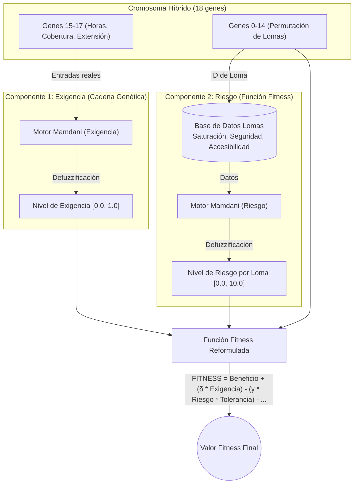

# Integración de Lógica Difusa en el Algoritmo Genético

Este documento explica de forma sencilla y práctica cómo estamos integrando la lógica difusa en nuestro Algoritmo Genético (AG) para la optimización de rutas de trekking en las lomas de Lima, cumpliendo con las observaciones del docente.

## 1. Introducción

El docente indicó que debemos integrar **dos componentes** de lógica difusa en el AG:
- **Componente 1:** Dentro de la cadena genética (el cromosoma).
- **Componente 2:** Dentro de la función de evaluación (función fitness).

Además, recibimos la observación de cambiar la métrica de "calidad de las lomas" por el **"nivel de riesgo de las lomas"**.

## 2. Componente 1: Nivel de Exigencia de Exploración (Cadena Genética)

### 2.1 ¿Qué es?
Es un sistema difuso tipo Mamdani que modela qué tan intensiva o exigente quiere el turista que sea su exploración. La novedad aquí es que las variables de entrada de este sistema difuso están codificadas como **genes reales (números con decimales)** dentro del propio cromosoma. Esto permite que el Algoritmo Genético evolucione y encuentre la exigencia óptima para la ruta.

### 2.2 Variables de entrada (3 variables)

Estas tres variables son los genes que se añaden al cromosoma:

**1. Horas de recorrido: [1, 6] horas**
- **Justificación:** Según nuestro catálogo de lomas (`destinos.json`), el rango real va desde 2.0h (Huaca Pucllana) hasta 6.0h (Lachay), con un promedio de 3.5h. El circuito largo de Lomas de Lúcumo toma 4-5h y la Ruta Zorro Místico en Carabayllo toma 4.5h.
- **Conjuntos Difusos:**
  - Corto: trapmf[1.0, 1.0, 1.5, 3.0]
  - Moderado: trimf[2.0, 3.5, 5.0]
  - Extenso: trapmf[4.0, 5.0, 6.0, 6.0]

**2. Cobertura de zona: [0.0, 1.0]**
- **Justificación:** Representa un porcentaje universal. 0.25 significa visitar solo un mirador, 0.5 un circuito corto, 0.75 un circuito largo y 1.0 es la cobertura completa del lugar.
- **Conjuntos Difusos:**
  - Parcial: trapmf[0.0, 0.0, 0.15, 0.35]
  - Intermedia: trimf[0.25, 0.50, 0.75]
  - Completa: trapmf[0.60, 0.80, 1.0, 1.0]

**3. Extensión del circuito: [1, 10] km**
- **Justificación:** Lomas de Lúcumo tiene el circuito más largo con 7 km. Lomas del Paraíso tiene aprox 2.6 km y Lachay (Circuito Perdiz) 5 km. Usamos 10 km como límite máximo para dar margen.
- **Conjuntos Difusos:**
  - Corto: trapmf[1.0, 1.0, 2.0, 4.5]
  - Medio: trimf[3.0, 5.5, 8.0]
  - Largo: trapmf[6.5, 8.5, 10.0, 10.0]

**Salida: nivel_exigencia [0.0, 1.0]**
- **Conjuntos Difusos:**
  - Relajado: trapmf[0.0, 0.0, 0.15, 0.35]
  - Moderado: trimf[0.25, 0.50, 0.75]
  - Intenso: trapmf[0.65, 0.85, 1.0, 1.0]

### 2.3 Base de reglas (12 reglas)

Estas son las reglas del sistema Mamdani que evalúan la exigencia:

**REGLAS DE EXIGENCIA INTENSA:**
- R1: SI horas ES Extenso Y cobertura ES Completa Y extensión ES Largo → exigencia ES Intenso
- R2: SI horas ES Extenso Y cobertura ES Completa Y extensión ES Medio → exigencia ES Intenso
- R3: SI horas ES Extenso Y cobertura ES Intermedia Y extensión ES Largo → exigencia ES Intenso
- R4: SI horas ES Moderado Y cobertura ES Completa Y extensión ES Largo → exigencia ES Intenso

**REGLAS DE EXIGENCIA MODERADA:**
- R5: SI horas ES Moderado Y cobertura ES Intermedia Y extensión ES Medio → exigencia ES Moderado
- R6: SI horas ES Extenso Y cobertura ES Parcial Y extensión ES Medio → exigencia ES Moderado
- R7: SI horas ES Corto Y cobertura ES Completa Y extensión ES Medio → exigencia ES Moderado
- R8: SI horas ES Moderado Y cobertura ES Completa Y extensión ES Corto → exigencia ES Moderado

**REGLAS DE EXIGENCIA RELAJADA:**
- R9: SI horas ES Corto Y cobertura ES Parcial Y extensión ES Corto → exigencia ES Relajado
- R10: SI horas ES Corto Y cobertura ES Parcial Y extensión ES Medio → exigencia ES Relajado
- R11: SI horas ES Corto Y cobertura ES Intermedia Y extensión ES Corto → exigencia ES Relajado
- R12: SI horas ES Moderado Y cobertura ES Parcial Y extensión ES Corto → exigencia ES Relajado

### 2.4 ¿Cómo se integra en el cromosoma?
Anteriormente, nuestro cromosoma solo tenía las lomas a visitar (una permutación de enteros). Ahora pasamos a un **cromosoma híbrido** de 18 genes:
- **Genes 0-14:** Permutación de las lomas (igual que antes).
- **Gen 15:** horas_recorrido (float entre 1 y 6)
- **Gen 16:** cobertura_zona (float entre 0 y 1)
- **Gen 17:** extension_circuito (float entre 1 y 10)

```text
[ L4 | L3 | L0 | ... | L14 || 4.2 | 0.65 | 6.8 ]
|___ Permutación (15) ____||__ Reales (3) ___|
```

### 2.5 Operadores genéticos adaptados
Al tener dos tipos de datos en el cromosoma, los operadores deben manejarlos de forma distinta:
- **Crossover (Cruce):** Usamos el método `OX` (Order Crossover) para la parte de permutación (genes 0-14). Para los genes reales (15-17), usamos `BLX-α` (Blend Crossover). En BLX-α, el hijo toma un valor aleatorio de un rango ampliado entre los genes de los padres.
- **Mutación:** Añadimos una cuarta estrategia: la **mutación gaussiana** exclusiva para los genes reales. La distribución de probabilidad para mutar ahora es:
  - Swap Activo-Reserva: 30% (Afecta permutación)
  - Swap Activo-Activo: 30% (Afecta permutación)
  - Inversión 2-Opt: 15% (Afecta permutación)
  - Mutación Gaussiana: 25% (Afecta genes reales)

### 2.6 Ejemplo paso a paso
Supongamos que el AG genera el siguiente individuo:
**Cromosoma:** `[L4, L3, L0, ..., L14, 4.2, 0.65, 6.8]`

Tomamos los genes reales y los pasamos al sistema difuso:
1. **horas = 4.2** → Activa el conjunto Moderado (con grado alto) y Extenso (con grado bajo).
2. **cobertura = 0.65** → Activa el conjunto Intermedia (grado alto) y Completa (grado bajo).
3. **extensión = 6.8** → Activa el conjunto Medio (grado alto) y Largo (grado bajo).

El motor difuso evalúa las 12 reglas, aplica la defuzzificación (método del centroide) y nos devuelve:
**nivel_exigencia ≈ 0.58** (que corresponde a una exigencia Moderada).

---

## 3. Componente 2: Nivel de Riesgo de las Lomas (Función Fitness)

### 3.1 ¿Qué es?
Por indicación del docente, reemplazamos la variable "calidad de las lomas" por el **"nivel de riesgo"**. La semántica se invierte: si antes un puntaje alto era bueno, ahora un **puntaje de riesgo alto es malo** y se restará como penalización en la función fitness.

### 3.2 Variables de entrada (3 variables — SIN clima)
Se elimina la variable clima/verdor ya que no tiene una relación directa con el riesgo de la visita.

**1. Saturación [0.0, 1.0]**
- Alta saturación implica MAYOR riesgo (congestionamiento, deterioro del ecosistema, riesgo de incidentes en senderos estrechos).
- **Conjuntos:** Baja trapmf[0.0, 0.0, 0.20, 0.40], Media trimf[0.25, 0.50, 0.75], Alta trapmf[0.60, 0.80, 1.0, 1.0]

**2. Seguridad [0.0, 10.0]**
- Baja puntuación en seguridad implica MAYOR riesgo (zona sin vigilancia, peligro de asaltos).
- **Conjuntos:** Riesgoso trapmf[0.0, 0.0, 2.5, 4.5], Moderado trimf[3.5, 6.0, 8.0], Seguro trapmf[7.0, 8.5, 10.0, 10.0]

**3. Accesibilidad [0.0, 10.0]**
- Baja puntuación en accesibilidad implica MAYOR riesgo (senderos peligrosos, dificultad para rescates).
- **Conjuntos:** Dificil trapmf[0.0, 0.0, 2.5, 4.5], Media trimf[3.5, 6.0, 8.0], Facil trapmf[7.0, 8.5, 10.0, 10.0]

**Salida: nivel_riesgo [0.0, 10.0]**
- **Conjuntos:** 
  - Muy_Bajo: trimf[0.0, 0.0, 2.5]
  - Bajo: trimf[1.5, 3.5, 5.0]
  - Medio: trimf[4.0, 5.5, 7.0]
  - Alto: trimf[6.0, 7.5, 9.0]
  - Muy_Alto: trapmf[7.5, 9.0, 10.0, 10.0]

### 3.3 Reglas difusas (invertidas respecto a calidad)
La lógica de las reglas es que las condiciones desfavorables aumentan el riesgo. Aquí hay ~16 reglas de ejemplo:

1. SI seguridad ES Riesgoso Y accesibilidad ES Dificil → riesgo ES Muy_Alto
2. SI saturacion ES Alta Y seguridad ES Riesgoso → riesgo ES Muy_Alto
3. SI saturacion ES Alta Y seguridad ES Moderado Y accesibilidad ES Dificil → riesgo ES Muy_Alto
4. SI saturacion ES Media Y seguridad ES Riesgoso Y accesibilidad ES Dificil → riesgo ES Muy_Alto
5. SI saturacion ES Alta Y seguridad ES Moderado Y accesibilidad ES Media → riesgo ES Alto
6. SI saturacion ES Media Y seguridad ES Riesgoso Y accesibilidad ES Media → riesgo ES Alto
7. SI saturacion ES Baja Y seguridad ES Riesgoso Y accesibilidad ES Dificil → riesgo ES Alto
8. SI saturacion ES Media Y seguridad ES Moderado Y accesibilidad ES Dificil → riesgo ES Alto
9. SI saturacion ES Media Y seguridad ES Moderado Y accesibilidad ES Media → riesgo ES Medio
10. SI saturacion ES Alta Y seguridad ES Seguro Y accesibilidad ES Facil → riesgo ES Medio
11. SI saturacion ES Alta Y seguridad ES Seguro Y accesibilidad ES Media → riesgo ES Medio
12. SI saturacion ES Baja Y seguridad ES Moderado Y accesibilidad ES Media → riesgo ES Medio
13. SI saturacion ES Baja Y seguridad ES Moderado Y accesibilidad ES Facil → riesgo ES Bajo
14. SI saturacion ES Baja Y seguridad ES Seguro Y accesibilidad ES Media → riesgo ES Bajo
15. SI saturacion ES Media Y seguridad ES Seguro Y accesibilidad ES Facil → riesgo ES Bajo
16. SI saturacion ES Baja Y seguridad ES Seguro Y accesibilidad ES Facil → riesgo ES Muy_Bajo

### 3.4 Ejemplo con lomas reales
- **L3 Manchay:** saturación=0.08, seguridad=6.0, accesibilidad=5.5 → `riesgo ≈ 3.5` (Bajo-Medio)
- **L9 Huaca Pucllana:** saturación=0.85, seguridad=9.5, accesibilidad=9.5 → `riesgo ≈ 3.0` (Bajo, porque aunque la saturación es alta, es muy seguro y accesible)
- **L8 Morro Solar:** saturación=0.70, seguridad=6.5, accesibilidad=8.5 → `riesgo ≈ 4.5` (Medio)

---

## 4. Función Fitness Reformulada

La nueva ecuación para calcular el fitness de una ruta es:

F(x) = + Suma beneficio_base(loma_i)
       + δ * nivel_exigencia
       - γ * Suma (riesgo_difuso(loma_i)) * factor_tolerancia
       - β * (Distancia / 100)
       - λ1 * (ExcesoPresupuesto / Presupuesto)^2
       - λ2 * (ExcesoTiempo / Tiempo)^2
       - 1000 * duplicados

**Donde:**
- **beneficio_base:** Es el puntaje intrínseco de la loma (tipo, temporada, patrimonio) calculado sin lógica difusa.
- **nivel_exigencia:** Valor obtenido del **Componente 1** (genes reales del cromosoma).
- **riesgo_difuso:** Valor obtenido del **Componente 2** (datos de la loma).
- **factor_tolerancia = 1.0 - (nivel_exigencia * 0.3)** → Lógica: Un turista que busca alta exigencia tolera un poco más de riesgo.
- **γ = 1.5** (peso de penalización por riesgo).
- **δ = 2.0** (peso de bonificación por cumplir la exigencia).

### 4.1 Ejemplo numérico completo
Evaluemos un individuo que propone visitar 3 lomas (K=3): `L4, L3, L0`.
Sus genes reales son: `horas=4.2, cob=0.65, ext=6.8`.
El usuario indicó: Presupuesto S/60, 3 días (12h por día disponibles, total 36h).

**Paso 1: Componente 1 (Exigencia)**
horas=4.2, cob=0.65, ext=6.8 → nivel_exigencia = **0.58**

**Paso 2: Componente 2 (Riesgo por loma)**
- L4 Mangomarca: sat=0.15, seg=6.5, acc=7.0 → riesgo = 2.8
- L3 Manchay: sat=0.08, seg=6.0, acc=5.5 → riesgo = 3.5
- L0 Paraíso: sat=0.15, seg=7.5, acc=6.5 → riesgo = 2.2

**Paso 3: Cálculo del Beneficio Base**
beneficio_base = 7.0 + 6.5 + 7.5 = **21.0**

**Paso 4: Bonificación por Exigencia**
bonificación = 2.0 * 0.58 = **1.16**

**Paso 5: Penalización por Riesgo**
riesgo_acumulado = 2.8 + 3.5 + 2.2 = 8.5
factor_tolerancia = 1.0 - (0.58 * 0.3) = 0.826
penalización_riesgo = 1.5 * (8.5 / 10.0) * 0.826 = **1.05** (se divide entre 10 para normalizar)

**Paso 6: Costo de Distancia**
Distancia total de la ruta = 23.55 km
costo_dist = 23.55 / 100 = **0.24** (asumiendo β=1.0)

**Paso 7: Restricciones**
Costo total S/35 <= S/60 → penalización = 0.0
Tiempo total 12h <= 36h → penalización = 0.0

**Paso 8: FITNESS TOTAL**
FITNESS = 21.0 (beneficio) + 1.16 (bono exigencia) - 1.05 (penalidad riesgo) - 0.24 (distancia) = **20.87**

---

## 5. Diagrama de Arquitectura



---

## 6. Resumen de correspondencia con indicaciones del docente

| Indicación del Docente | Cómo se cumple en nuestra implementación |
| :--- | :--- |
| **1. Integrar lógica difusa en el cromosoma** | Se creó el **Componente 1**, que toma 3 variables (horas, cobertura, extensión) codificadas como genes reales en el cromosoma para calcular el *nivel de exigencia* mediante un sistema difuso. |
| **2. Integrar lógica difusa en la Función Fitness** | Se creó el **Componente 2**, que toma datos de las lomas para calcular el *nivel de riesgo*. Este valor se evalúa directamente dentro de la función de fitness para penalizar las rutas peligrosas. |
| **3. Reemplazar "Calidad" por "Riesgo"** | Se eliminó el módulo anterior de calidad. Ahora el sistema difuso del Componente 2 se enfoca en saturación, seguridad y accesibilidad para determinar el riesgo (puntaje alto = malo). |

---

## 7. Archivos que deberán modificarse

Para implementar estos cambios, trabajaremos en los siguientes archivos:

| Archivo | Cambios principales a realizar |
| :--- | :--- |
| `fuzzy_module.py` | Implementar los dos motores Mamdani (uno para exigencia y otro para riesgo). Definir funciones de membresía y reglas. |
| `genetic_algorithm.py` | Modificar la clase del cromosoma para soportar genes mixtos. Actualizar operadores de cruce (BLX-α) y mutación (Gaussiana). Actualizar la función fitness con la nueva fórmula. |
| `main.py` | Adaptar la instanciación del AG y la lectura de los resultados finales. |
| `app.py` | Mostrar en la interfaz el nivel de exigencia generado y los niveles de riesgo de las lomas seleccionadas. |
| `tests/` | Actualizar pruebas unitarias del cromosoma y de los motores difusos. |
